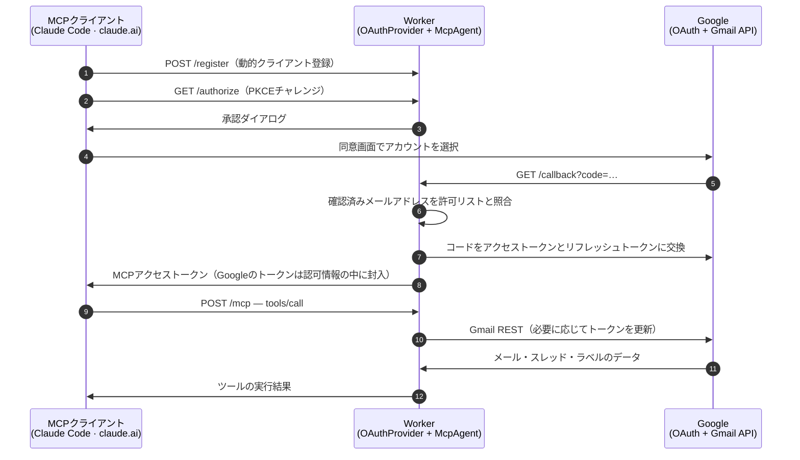

# gmail-mcp

[](./LICENSE)
[](https://developers.cloudflare.com/workers/)
[](https://modelcontextprotocol.io/)
[](#-できること)
[](#-テスト)

*[English README](./README.md) · [简体中文](./README.zh.md)*

<p align="center">
<picture>
  <source media="(prefers-color-scheme: dark)" srcset="./docs/demo.ja-dark.svg">
  <source media="(prefers-color-scheme: light)" srcset="./docs/demo.ja-light.svg">
  
</picture>
</p>

**gmail-mcp**は、ClaudeなどのMCPクライアントからGmailを読み書きできるようにするツールです。複数のGoogleアカウントを同時に接続でき、メールの検索・閲覧から、送信・全員返信・転送、添付ファイルやインライン画像の扱いまで行えます。

自分のCloudflare Workerの上で動くので、ノートPCのClaude Code、ブラウザのclaude.ai、スマートフォンのClaudeから同じエンドポイントに接続できます。接続ごとにGoogleアカウントへサインインする方式で、リフレッシュトークンは自分のCloudflareアカウントから外に出ません。

---

## 🔮 できること

**読む** — `whoami` · `search_messages` · `get_message` · `get_thread` · `get_attachment`

**書く** — `send_message` · `reply_all` · `forward_message` · `create_draft` · `update_draft` · `send_draft` · `delete_draft` · `list_drafts`

**整理する** — `list_labels` · `create_label` · `update_label` · `delete_label` · `modify_labels` · `modify_thread_labels` · `batch_modify_messages` · `trash_message` · `untrash_message` · `trash_thread` · `untrash_thread`

送信するメールの構造は、通常のメールクライアントが組み立てるものと同じです。プレーンテキストにHTML版を添え、ファイルを添付し、`cid:`で参照するインライン画像を埋め込みます。入れ子は`multipart/mixed › multipart/related › multipart/alternative`になります。件名と表示名はRFC 2047、ファイル名はRFC 2231で符号化するので、日本語も中国語も絵文字もそのまま届きます。

`reply_all`は元メールの`Reply-To`・`From`・`To`・`Cc`を読み、自分のアドレスを除いて宛先を組み立て、`References`の連鎖を引き継ぎ、本文をテキストとHTMLの両方で引用します。`forward_message`では転送元のヘッダを再現し、元の添付ファイルをそのまま付け直せます。

読み取り側には上限を設けてあります。本文とスレッドには文字数、添付ファイルにはサイズの上限があり、長いメーリングリストのスレッドがアシスタントのコンテキストを圧迫することはありません。

---

## 🚀 導入

所要時間は10分ほどです。独自ドメインを設定したCloudflareアカウントと、[bun](https://bun.sh)、Googleアカウントを用意してください。

### 1. Google OAuthクライアントを作る

```sh
PROJECT="gmail-mcp-$(openssl rand -hex 3)"
gcloud auth login
gcloud projects create "$PROJECT" --name="gmail-mcp"
gcloud config set project "$PROJECT"
gcloud services enable gmail.googleapis.com
```

続く2つの手順にAPIは用意されていないので、コンソールで操作してください。

- **OAuth同意画面** → *External*。審査前の状態では、接続したいメールアドレスを**テストユーザー**に登録します。
- **認証情報 → 認証情報を作成 → OAuthクライアントID** → *ウェブアプリケーション*。承認済みリダイレクトURIに`https://<自分のドメイン>/callback`を追加し、クライアントIDとシークレットを控えておきます。

### 2. Workerをデプロイする

```sh
git clone https://github.com/mkpoli/gmail-mcp && cd gmail-mcp
bun install
# wrangler.jsoncの`name`とroutesの`pattern`を自分のドメインに変更します
bun run setup
```

`bun run setup`では、KV名前空間の作成、クライアントIDとシークレットの入力、Cookie鍵の生成、デプロイまでを行います。シークレットを1つ入れ替えるだけの場合も、そのまま再実行できます。

### 3. クライアントをつなぐ

クライアントIDとシークレットの欄は空のままにしてください。MCPクライアントは自分で登録します。

```sh
claude mcp add --transport http gmail-personal https://<自分のドメイン>/mcp
claude mcp add --transport http gmail-work     https://<自分のドメイン>/mcp/work
```

Claude Codeでは`/mcp`を実行し、接続ごとに対応するGoogleアカウントでサインインします。claude.aiの場合は**設定 → コネクタ → カスタムコネクタを追加**から同じURLを入力してください。`/mcp/`の後ろには任意の1階層のラベルを指定できます。同じURLのサーバーを2つ登録できないクライアントでも、この方法なら1つのデプロイで複数のメールボックスを扱えます。

デプロイ先のトップページ`https://<自分のドメイン>/`では、この手順をそのまま表示します。

---

## ⚙️ 設定

### サインインを許可するアカウント

`ALLOWED_EMAILS`で指定します。同意画面のあと、認可情報を発行する前に、Googleが確認済みとして返したメールアドレスと照合します。

| 値 | サインインできるアカウント |
| :-- | :-- |
| *(空)* | なし |
| `you@gmail.com, work@company.com` | 指定したアカウントのみ |
| `*@company.com` | そのドメインのアカウント |
| `*` | 確認済みのGoogleアカウントすべて |

認可情報は、認証したメールボックスにだけ紐づきます。この一覧を広げても、すでに接続しているメールボックスへのアクセス範囲は変わりません。`*`を指定すると、第三者が自分のメールを扱うために、このデプロイとGoogle OAuthクライアントのクォータを使えるようになります。

### 上限

共有で公開したときに使い切られないよう、2つの上限を設けてあります。どちらも`wrangler.jsonc`の`vars`で変更できます。

| 設定 | 既定値 | 制限する対象 |
| :-- | :-- | :-- |
| `MAX_ACCOUNTS` | `25` | サインインを許可するGoogleアカウントの総数。上限に達しても接続済みのアカウントはそのまま使えて、新規のサインインだけを断ります。Googleは審査前のアプリを100ユーザーに制限しているので、それ以下に収めてください。 |
| `CALLS_PER_MINUTE` | `120` | 1アカウントが1分間にGmail APIを呼び出せる回数。セッションをまたいで合算します。 |

変更したあとは再デプロイしてください。レート制限にはCloudflareのレートリミッターを使うので、`unsafe.bindings`の`limit`も同じ値に揃えます。個人で使う場合は、既定値のままで問題ありません。

---

## 🏗 仕組み

2つのOAuthフローが1つのWorkerの中で合流します。MCPクライアントはWorkerに対して認証し、Workerはユーザーに代わってGoogleに対して認証します。どちらの側も、もう一方の認証情報を持ちません。



<p align="center">
<picture>
  <source media="(prefers-color-scheme: dark)" srcset="./docs/architecture-dark.svg">
  <source media="(prefers-color-scheme: light)" srcset="./docs/architecture-light.svg">
  
</picture>
</p>

| 層 | ファイル | 役割 |
| :-- | :-- | :-- |
| 🔐 MCP側のOAuth | [`workers-oauth-provider`](https://github.com/cloudflare/workers-oauth-provider) | 動的クライアント登録、PKCE、KVに保存する認可情報（Googleのトークンを内部に封入） |
| 🔗 Google側のOAuth | `src/google-handler.ts` | オフラインアクセス付きの認可コードフロー、ブラウザセッションに紐づく1回限りのstate、double-submit CSRF、確認済みメールアドレスの照合 |
| 🤖 エージェント | `src/index.ts` | MCPセッションごとのDurable Object（開いたアカウントに紐づく）、single-flightなトークン更新、同時実行数の制限 |
| ✉️ メール | `src/gmail.ts` | RFC 822の組み立て、MIMEツリーの走査、文字コードのデコード、返信と転送の組み立て |

### 使っている技術

- **[TypeScript](https://www.typescriptlang.org/)と[Cloudflare Workers](https://developers.cloudflare.com/workers/)** — MCPセッションごとにDurable Object、OAuthの認可情報はKVに保存
- **[Hono](https://hono.dev/)** — OAuthの各エンドポイント、Googleからのコールバック、`/`の導入ページのルーティング
- **[`@cloudflare/workers-oauth-provider`](https://github.com/cloudflare/workers-oauth-provider)** — MCPクライアントが登録するOAuth 2.1サーバー
- **[`agents`](https://github.com/cloudflare/agents)** — `McpAgent`、Durable Object上のMCPトランスポート
- **[`@modelcontextprotocol/sdk`](https://github.com/modelcontextprotocol/typescript-sdk)**と**[Zod](https://zod.dev/)** — ツール定義と引数の検証
- **[Bun](https://bun.sh/)**・**[Biome](https://biomejs.dev/)**・**[Wrangler](https://developers.cloudflare.com/workers/wrangler/)** — 導入、テスト、静的解析、デプロイ

GmailへのアクセスにはREST APIを`fetch`で直接呼び出しています。公式の`googleapis` SDKはNode.jsが前提で、Workerに載せるには依存が大きいため、メールの組み立て、MIMEの解析、トークンの更新は`src/gmail.ts`と`src/utils.ts`に実装しています。

### エンドポイント

| パス | 用途 |
| :-- | :-- |
| `/mcp` | MCPエンドポイント |
| `/mcp/<label>` | 同じサーバーを別のURLで提供します。同じURLのサーバーを2つ登録できないクライアント向けです |
| `/` | 導入ページ |
| `/authorize` · `/token` · `/register` · `/callback` | OAuthの各エンドポイント |

---

## 🔒 セキュリティ

自分で運用しても信頼はゼロにはならず、預け先が変わります。何がどこに置かれるかを書いておきます。

- **トークンは自分の手元に残ります。**リフレッシュトークンはOAuthの認可情報の中で暗号化され、自分のKV名前空間に入ります。有効期間1時間のアクセストークンは、セッションのDurable Objectに置かれます。メール本文はどこにも保存されず、通過するだけです。
- **1セッションにつき1メールボックスです。**MCPセッションは、それを開いたアカウントに紐づきます。他人のセッションIDを使っても、別のメールボックスは操作できません。
- **スコープを絞っています。** `gmail.modify`で許可されるのは、閲覧・送信・ラベル操作・ゴミ箱への移動までです。完全削除と`gmail.settings.*`配下は含まれません。乗っ取り後によく使われる自動転送やフィルタの作成は、そもそも権限の外にあります。
- **ヘッダインジェクションを防ぎます。**送信ヘッダの値にCRやLFが含まれていれば拒否します。本文に仕込まれたプロンプトインジェクションにモデルが従っても、`Bcc`を足すことはできません。引用部分はHTMLエスケープを通します。
- **取り消しが効きます。**新規のサインインを止めるなら`ALLOWED_EMAILS`を狭めます。[myaccount.google.com/connections](https://myaccount.google.com/connections)でアプリのアクセスを取り消すか、Googleのクライアントシークレットを再生成すると、すべての認可情報を一度に無効化できます。

リクエストを処理する間、Workerはメールをメモリ上で復号します。中継する以上、これは避けられません。特定のメールボックスでそれが許容できない場合は、そのアカウントだけローカルのMCPサーバーを使うほうが適しています。

---

## ✅ テスト

66件の単体テストで、メールの組み立て（MIMEの入れ子、RFC 2047の折り返し、RFC 2231のファイル名、CR/LFの拒否、base64の折り返し）、文字コードをまたぐ本文の取り出し、返信と転送の組み立て、Googleのトークン処理、サインイン許可リストの判定を検証しています。

実際のGmailアカウントの間でも、すべてのツールの動作を確認しました。

| 項目 | 結果 |
| :-- | :-- |
| 文字コード | 日本語の件名は複数のencoded-wordに折り返したあとも復元でき、絵文字・ZWJ・アラビア語・結合文字・稀少漢字もそのまま往復しました |
| 添付ファイル | `請求書.csv`は送信時・受信時・再ダウンロード時の内容がバイト単位で一致し、`cid:`のインライン画像も受信側で表示されました |
| スレッド | `reply_all`は元の送信者を宛先に、第三者を`Cc`に残し、自分のアドレスを除いたうえで、同じスレッド内に原文を引用しました |
| 複数アカウント | 2つのアカウントを1つのデプロイに同時接続した状態で、一方のメッセージIDをもう一方から読むと`404`が返りました |
| ラベル操作 | 入れ子のラベルを作成・改名・一括適用・削除し、スレッドとメール単位のゴミ箱操作も元に戻せました |
| 規模 | 15,000通のメールボックスをGmailの検索構文とページネーションで検索しても、レート制限には達しませんでした |

---

## 🛠 開発

```sh
bun run dev     # wrangler dev、:8788
bun run check   # biome + tsc
bun test        # 単体テスト66件
bun run assets  # ライト・ダークの図を再生成
bun run deploy
```

## 📮 お問い合わせ

不具合の報告や機能のご要望は、[Issues](https://github.com/mkpoli/gmail-mcp/issues)へお寄せください。

## ライセンス

Copyright © 2026 mkpoli. [MIT License](./LICENSE)で公開しています。

`src/workers-oauth-utils.ts`は、[cloudflare/ai](https://github.com/cloudflare/ai)の[remote-mcp-github-oauthデモ](https://github.com/cloudflare/ai/tree/main/demos/remote-mcp-github-oauth)に由来します。Copyright © 2025 Cloudflare, Inc.、MIT Licenseに基づいて利用しています。詳細は[THIRD-PARTY.md](./THIRD-PARTY.md)をご覧ください。
