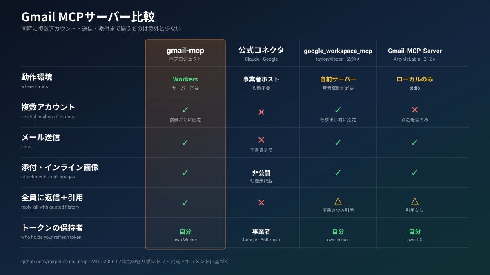

# gmail-mcp

GmailをClaudeなどのAIアシスタントにつなぐ。複数アカウントを同時に、自分のサーバーから。

[](./LICENSE)
[](https://developers.cloudflare.com/workers/)
[](https://modelcontextprotocol.io/)
[](#できること)
[](#開発)

*[English README](./README.md) · [简体中文](./README.zh.md)*

<p align="center">
<picture>
  <source media="(prefers-color-scheme: dark)" srcset="./docs/demo.ja-dark.svg">
  <source media="(prefers-color-scheme: light)" srcset="./docs/demo.ja-light.svg">
  
</picture>
</p>

**gmail-mcp**はGmailをClaudeをはじめとする [MCP](https://modelcontextprotocol.io/) クライアントにつなぐ。**検索と閲覧**、引用付きの**送信と全員返信**、**転送**、**添付とインライン画像**、下書き・ラベル・スレッドの操作までを、**複数のGoogleアカウントで同時に**扱える。

置き場所は**自分のCloudflare Worker**。同じ接続先に、ノートPCのClaude Codeからも、ブラウザのclaude.aiからも、スマートフォンからも届く。接続1つにつきGoogleアカウントは1つ、リフレッシュトークンは**自分の**Cloudflareアカウントから外に出ない。

ここに来る理由はたいてい二つある。ClaudeとGoogleの公式Gmailコネクタは、読むことと下書きまではできるが**送信ができず**、アシスタント1つにつきGoogleアカウントも1つに限られる。送信できる実装の多くはローカルのプロセスで、机の前では快適でも、外出先のスマートフォンからは見えない。

<p align="center">

</p>

[google_workspace_mcp](https://github.com/taylorwilsdon/google_workspace_mcp) はこの分野でもっとも完成度が高い。GmailだけでなくWorkspace全体を扱い、Gmailの署名の付加やURLからの添付取得など、gmail-mcpにない機能もある。複数アカウントの扱いは、呼び出しのたびに宛先アカウントを引数で渡す設計だ。接続そのものにメールボックスを結びつけるgmail-mcpでは、引数を間違えてもどこにも届かない。

[shinzo-labs/gmail-mcp](https://github.com/shinzo-labs/gmail-mcp) のツール数は64、こちらは23。差の大半は不在応答・代理アクセス・S/MIMEといった `gmail.settings.*` の領域で、gmail-mcpはこのスコープを要求しない。権限が漏れたとしても、その範囲には手が届かない。

読み取り側にも差が出る。ローカル型のサーバーはどのパートもUTF-8として復号するため、ISO-2022-JPやShift_JISのメールは文字化けし、Gmailが添付として保管する長文の本文は空で返ってくる。

---

## 導入

所要時間はおよそ10分。大半は二つのブラウザ画面での作業になる。必要なものは、独自ドメインを載せたCloudflareアカウントと [bun](https://bun.sh)、それにGoogleアカウント。

**1 · GoogleのOAuthクライアントを作る。** [gcloud CLI](https://cloud.google.com/sdk/docs/install) を入れて、次を実行する。

```sh
PROJECT="gmail-mcp-$(openssl rand -hex 3)"
gcloud auth login
gcloud projects create "$PROJECT" --name="gmail-mcp"
gcloud config set project "$PROJECT"
gcloud services enable gmail.googleapis.com
```

続く二つの手順にAPIは用意されていないので、コンソールで操作する。

- **OAuth同意画面** → *External*。審査前の状態では、接続したいメールアドレスを **テストユーザー** に登録しておく。
- **認証情報 → 認証情報を作成 → OAuthクライアントID** → *ウェブアプリケーション*。承認済みリダイレクトURIに `https://<自分のドメイン>/callback` を追加し、クライアントIDとシークレットを控える。

**2 · Workerをデプロイする。**

```sh
git clone https://github.com/mkpoli/gmail-mcp && cd gmail-mcp
bun install
# wrangler.jsoncの `name`とroutesの `pattern`を自分のドメインに変える
bun run setup
```

`bun run setup` がKV名前空間を作り、クライアントIDとシークレットを尋ね、Cookie用の鍵を生成してデプロイまで行う。シークレットを1つ入れ替えたいだけのときに再実行しても問題ない。

**3 · クライアントをつなぐ。**クライアントIDとシークレットの欄は空のままでいい。MCPクライアントは自分で登録する。

```sh
claude mcp add --transport http gmail-personal https://<自分のドメイン>/mcp
claude mcp add --transport http gmail-work     https://<自分のドメイン>/mcp/work
```

Claude Codeなら `/mcp` を実行して、それぞれを対応するGoogleアカウントでサインインさせる。claude.aiの場合は **設定 → コネクタ → カスタムコネクタを追加** に同じURLを入れる。`/mcp/` の後ろは自由な1階層のラベルで、URLが重複するサーバーを受け付けないクライアントでも、1つのデプロイで複数のメールボックスを扱える。

デプロイ先のトップページ `https://<自分のドメイン>/` には、この手順がそのまま表示される。

---

## できること

**読む** — `whoami` · `search_messages` · `get_message` · `get_thread` · `get_attachment`

**書く** — `send_message` · `reply_all` · `forward_message` · `create_draft` · `update_draft` · `send_draft` · `delete_draft` · `list_drafts`

**整理する** — `list_labels` · `create_label` · `update_label` · `delete_label` · `modify_labels` · `modify_thread_labels` · `batch_modify_messages` · `trash_message` · `untrash_message` · `trash_thread` · `untrash_thread`

送信するメールの構造は、通常のメールクライアントが組み立てるものと同じだ。プレーンテキストにHTML版を添え、ファイルを添付し、`cid:` で参照するインライン画像を埋め込む。入れ子は `multipart/mixed › multipart/related › multipart/alternative` になる。件名と表示名はRFC 2047、ファイル名はRFC 2231で符号化するので、日本語も中国語も絵文字もそのまま届く。

`reply_all` は元メールの `Reply-To`・`From`・`To`・`Cc` を読み、自分のアドレスを除いて宛先を組み立て、`References` の連鎖を引き継ぎ、本文をテキストとHTMLの両方で引用する。`forward_message` は転送元のヘッダを再現し、元の添付ファイルをそのまま付け直せる。

読み取り側には上限を設けてある。本文とスレッドには文字数、添付にはサイズの上限があり、長大なメーリングリストのスレッドがアシスタントの文脈を埋め尽くすことはない。

---

## 使っている技術

- **[TypeScript](https://www.typescriptlang.org/) / [Cloudflare Workers](https://developers.cloudflare.com/workers/)** — MCPセッションごとにDurable Object、OAuthの権限情報はKV
- **[Hono](https://hono.dev/)** — OAuthの各エンドポイント、Googleからのコールバック、`/` の導入ページのルーティング
- **[`@cloudflare/workers-oauth-provider`](https://github.com/cloudflare/workers-oauth-provider)** — MCPクライアントが登録しに来るOAuth 2.1サーバー
- **[`agents`](https://github.com/cloudflare/agents)** — `McpAgent`、Durable Object上のMCPトランスポート
- **[`@modelcontextprotocol/sdk`](https://github.com/modelcontextprotocol/typescript-sdk)** と **[Zod](https://zod.dev/)** — ツール定義と引数の検証
- **[Bun](https://bun.sh/)**・**[Biome](https://biomejs.dev/)**・**[Wrangler](https://developers.cloudflare.com/workers/wrangler/)** — 導入、テスト、静的解析、デプロイ

Gmail自体は [REST API](https://developers.google.com/workspace/gmail/api/reference/rest) を素の `fetch` で呼ぶ。公式の `googleapis` SDKはNodeを前提とし、Workerに載せるには重すぎる。メールの組み立て、MIMEの解析、トークンの更新は `src/gmail.ts` と `src/utils.ts` に置いてある。

---

## サインインできる人

決めるのは `ALLOWED_EMAILS` の値だ。Googleが「確認済み」として返すアドレスと照合され、同意画面の後、権限が発行される前に判定される。

| 値 | 通る人 |
| :-- | :-- |
| *(空)* | 誰も通らない |
| `you@gmail.com, work@company.com` | そのアカウントだけ |
| `*@company.com` | そのドメインの全員 |
| `*` | 確認済みのGoogleアカウントすべて |

発行された権限は、その認証を通したメールボックスにしか届かない。したがってこの一覧を広げても、すでにつながっているメールボックスへの到達範囲が広がることはない。`*` にした場合に他人へ渡るのは、自分のデプロイとGoogleクライアントの割り当て量を、その人自身のメールのために使わせることだ。

---

## 制限

共有で公開したときに使い潰されないよう、上限を2つ設けてある。どちらも `wrangler.jsonc` の `vars` で変更できる。

| 設定 | 既定値 | 制限する対象 |
| :-- | :-- | :-- |
| `MAX_ACCOUNTS` | `25` | サインインを通すGoogleアカウントの総数。上限に達しても既存の接続はそのまま動き、新規だけが断られる。Googleは審査前のアプリを100ユーザーに制限しているので、それ以下に収める。 |
| `CALLS_PER_MINUTE` | `120` | 1アカウントが1分間に呼べるGmailの回数。セッションをまたいで合算される。 |

値を変えたら再デプロイする。レート制限はCloudflare側の実装を使うため、`unsafe.bindings` の `limit` も同じ値に揃える。個人で使う分にはどちらも既定のままでよい。

---

## セキュリティ

自分で運用するという選択は、信頼の置き場所を移すだけで、なくすわけではない。だから何がどこにあるかを書いておく。

- **トークンは自分の手元に残る。**リフレッシュトークンはOAuthの権限情報の中で暗号化され、自分のKV名前空間に入る。有効期間1時間のアクセストークンはセッションのDurable Objectに置かれる。メール本文はどこにも保存されない。通過するだけだ。
- **1セッションにつき1メールボックス。**MCPセッションは、それを開いたアカウントに結びつく。他人のセッションIDを借りても、別のメールボックスは操作できない。
- **スコープを絞る。** `gmail.modify` が覆うのは読み取り・送信・ラベル・ゴミ箱まで。完全削除と `gmail.settings.*` は含まれない。自動転送やフィルタによる持ち出しという、乗っ取り後の定番の裏口が、そもそも権限の外にある。
- **悪意あるメールからヘッダを注入されない。**送信ヘッダの値はCRとLFを拒否する。本文に仕込まれた指示がモデルを動かしても、こっそり `Bcc` を足すことはできない。引用部分はHTMLエスケープを通る。
- **取り消しが効く。**新規のサインインを止めるなら `ALLOWED_EMAILS` を狭める。[myaccount.google.com/connections](https://myaccount.google.com/connections) でアプリのアクセスを取り消す。すべての権限を一度に無効化したいならGoogleのクライアントシークレットを再生成する。

なお、リクエストを処理する間、Workerはメールをメモリ上で復号する。中継する以上これは避けられない。特定のメールボックスについてそれが許容できないなら、そのアカウントだけはローカルのMCPサーバーを使うほうがいい。

---

## 開発

```sh
bun run dev     # wrangler dev、:8788
bun run check   # biome + tsc
bun test        # 単体テスト 66 件
bun run assets  # ライト・ダークの図を再生成
bun run deploy
```

66件の単体テストが見ているのは、メール構築（MIMEの入れ子、RFC 2047の折り返し、RFC 2231のファイル名、CR/LFの拒否、base64の折り返し）、文字コードをまたぐ本文の取り出し、返信と転送の組み立て、Googleのトークン処理、サインイン許可リストの判定。

実際のGmailアカウント間でも全ツールを通してある。日本語の件名は複数のencoded wordに折り返されて復元され、絵文字・ZWJ・アラビア語・結合文字・稀少漢字はそのまま往復した。`請求書.csv` は送信・受信・再ダウンロードでバイト単位に一致し、`cid:` のインライン画像は受信側で表示された。2つのアカウントを同時に接続した状態で、一方のメッセージIDをもう一方から読むと `404` が返る。

## ライセンス

Copyright © 2026 mkpoli. [MIT License](./LICENSE) で公開。

`src/workers-oauth-utils.ts` は [cloudflare/ai](https://github.com/cloudflare/ai) の [remote-mcp-github-oauthデモ](https://github.com/cloudflare/ai/tree/main/demos/remote-mcp-github-oauth) に由来する。Copyright © 2025 Cloudflare, Inc.、MIT Licenseに基づき利用。詳細は [THIRD-PARTY.md](./THIRD-PARTY.md)。
