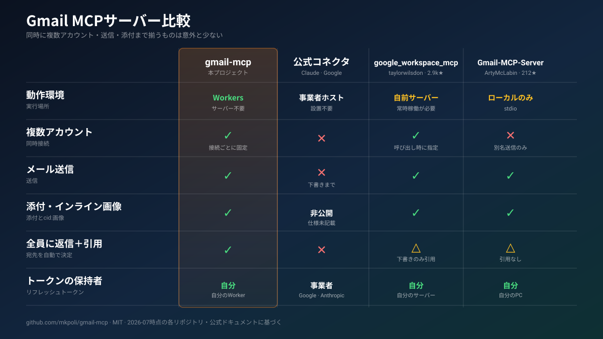
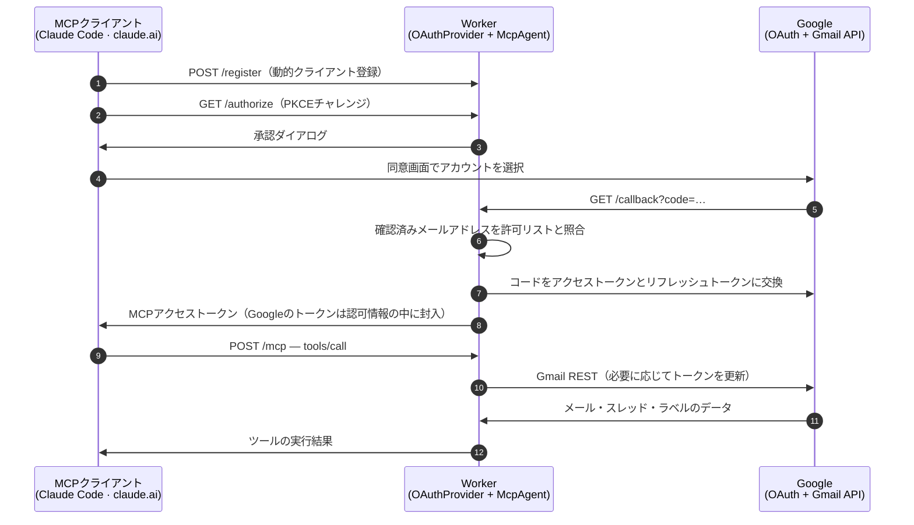

# gmail-mcp

[](./LICENSE)
[](https://developers.cloudflare.com/workers/)
[](https://modelcontextprotocol.io/)
[](https://datatracker.ietf.org/doc/html/draft-ietf-oauth-v2-1)
[](#-できること)
[](#-テスト)

*[English README](./README.md) · [简体中文](./README.zh.md)*

<p align="center">
<picture>
  <source media="(prefers-color-scheme: dark)" srcset="./docs/demo.ja-dark.svg">
  <source media="(prefers-color-scheme: light)" srcset="./docs/demo.ja-light.svg">
  
</picture>
</p>

**gmail-mcp**は、ClaudeなどのMCPクライアントからGmailを読み書きできるようにするツールです。複数のGoogleアカウントを同時に接続でき、メールの検索・閲覧から、送信・全員返信・転送、添付ファイルやインライン画像の扱いまで行えます。

自分のCloudflare Workerの上で動くので、ノートPCのClaude Code、ブラウザのclaude.ai、スマートフォンのClaudeから同じエンドポイントに接続できます。接続ごとにGoogleアカウントへサインインする方式で、リフレッシュトークンは自分のCloudflareアカウントから外に出ません。

---

## ⚖️ 他のサーバーとの比較

<p align="center">

</p>

<details>
<summary><b>より詳しい比較</b> — 6つのプロジェクト、12項目</summary>

<br>

| | **gmail-mcp** | [Claude](https://claude.com/connectors/gmail) · [Google](https://developers.google.com/workspace/gmail/api/guides/configure-mcp-server) 公式 | [taylorwilsdon/<br>google_workspace_mcp](https://github.com/taylorwilsdon/google_workspace_mcp) | [ArtyMcLabin/<br>Gmail-MCP-Server](https://github.com/ArtyMcLabin/Gmail-MCP-Server) | [shinzo-labs/<br>gmail-mcp](https://github.com/shinzo-labs/gmail-mcp) | [aaronsb/<br>google-workspace-mcp](https://github.com/aaronsb/google-workspace-mcp) |
| :-- | :-: | :-: | :-: | :-: | :-: | :-: |
| 動作環境 | Cloudflare Workers | 事業者ホスト | 自前サーバーまたはローカル | ローカル | ローカル | ローカル |
| スマートフォンから利用 | ✅ | ✅ | ✅ | ❌ | ❌ | ❌ |
| 複数アカウントの同時接続 | ✅ 接続ごとに固定 | ❌ | ✅ 呼び出し時に指定 | ❌ 別名のみ | ❌ | ✅ 呼び出し時に指定 |
| メール送信 | ✅ | ❌ | ✅ | ✅ | ✅ | ✅ |
| 添付・`cid:`インライン画像 | ✅ | 記載なし | ✅ | ✅ | ❌ | ✅ |
| 全員返信と原文の引用 | ✅ | ❌ | 下書きのみ | 引用なし | ❌ | ✅ |
| 転送 | ✅ | ❌ | ✅ | ❌ | ❌ | ✅ |
| パートごとの文字コード判定 | ✅ | — | ❌ UTF-8固定 | ❌ UTF-8固定 | ❌ | ❌ |
| CRLFヘッダインジェクションの拒否 | ✅ | — | ✅ フレームワーク側 | ✅ 除去 | ❌ **なし** | ✅ |
| メールボックス設定（フィルタ、不在通知） | ❌ スコープ外 | ❌ | フィルタ | フィルタ | ✅ | ❌ |
| ツール数 | 24 | 11〜16 | 14（Gmail分） | 30 | 64 | 11 |
| リフレッシュトークンの保持者 | 自分 | 事業者 | 自分 | 自分 | 自分 | 自分 |

[`google_workspace_mcp`](https://github.com/taylorwilsdon/google_workspace_mcp)はこの分野で最も完成度が高く、GmailだけでなくWorkspace全体を扱えます。Gmailの署名の付加やURLからの添付取得など、gmail-mcpにない機能もあります。[`shinzo-labs/gmail-mcp`](https://github.com/shinzo-labs/gmail-mcp)は64個のツールで不在通知・代理アクセス・S/MIMEまで届きます。これらは`gmail.settings.*`配下の機能で、gmail-mcpはこのスコープを要求しないため、認可情報が漏れた場合もそこには手が届きません。

残りの差は主に2つの設計から生まれます。呼び出しの引数でアカウントを切り替える方式では、1つの認可情報が接続済みのすべてのメールボックスに届きます。接続にメールボックスを固定する方式なら、引数を間違えてもどこにも届きません。読み取りでは、ローカル型のサーバーはすべてのMIMEパートをUTF-8として復号するため、ISO-2022-JPやShift_JISのメールは文字化けし、Gmailが添付データとして返す長い本文は空のまま返ってきます。

</details>

---

## 🚀 導入

所要時間は10分ほどです。Cloudflareアカウント、[Bun](https://bun.sh)、Googleアカウントを用意してください。独自ドメインは任意で、なければworkers.devのホスト名で応答します。

### 1. Google OAuthクライアントを作る

```sh
PROJECT="gmail-mcp-$(openssl rand -hex 3)"
gcloud auth login
gcloud projects create "$PROJECT" --name="gmail-mcp"
gcloud config set project "$PROJECT"
gcloud services enable gmail.googleapis.com
```

以下の2項目には設定用のAPIがないため、[Google Cloudコンソール](https://console.cloud.google.com/)で操作してください。

- [**OAuth同意画面**](https://console.cloud.google.com/auth/overview)で、ユーザーの種類に*External*を選び、**Audience**の**Publish app**で公開します。Testingのままだと、Googleは7日ごとにすべてのrefresh tokenを失効させ、接続もそのたびに切れます。公開後はログイン時に未確認アプリの警告が出ますが、最大100アカウントまで接続できます。
- [**認証情報**](https://console.cloud.google.com/apis/credentials) **→ 認証情報を作成 → OAuthクライアントID** → *ウェブアプリケーション*。承認済みのリダイレクトURIに`https://<ホスト名>/callback`を追加し、クライアントIDとシークレットを控えておきます。

`<ホスト名>`は、Workerに向けた独自ドメインか、割り当てられるworkers.devのホスト名です。先にデプロイしてから登録しても構いません。Workerが`/`で配信する手順ページに、そのままの値が出ています。

### 2. Workerをデプロイする

[](https://deploy.workers.cloudflare.com/?url=https://github.com/mkpoli/gmail-mcp)

ボタンからだと、リポジトリが自分のGitHubアカウントに複製され、KV名前空間とDurable Objectが作られ、4つのシークレットを尋ねられます。デプロイ先はworkers.devで、独自ドメインは後から**Settings → Domains & Routes**で割り当てます。

ターミナルからの場合:

```sh
git clone https://github.com/mkpoli/gmail-mcp && cd gmail-mcp
bun install
bun run setup
```

`bun run setup`では、応答させるドメインの指定、`OAUTH_KV`名前空間の作成または再利用、クライアントIDとシークレットの入力、Cookie鍵の生成、デプロイまでを行います。前半2つの答えは`wrangler.local.jsonc`に書き出され、gitの管理外に置かれます。`wrangler.jsonc`には特定のアカウントの名前空間もドメインも入らないので、クローンをそのまま好きなアカウントへデプロイできます。シークレットを1つ入れ替えるだけの場合も、そのまま再実行できます。

### 3. クライアントをつなぐ

クライアントIDとシークレットの欄は空のままにしてください。MCPクライアントは自分で登録します。

```sh
claude mcp add --transport http gmail-personal https://<ホスト名>/mcp
claude mcp add --transport http gmail-work     https://<ホスト名>/mcp/work
```

Claude Codeでは`/mcp`を実行し、接続ごとに対応するGoogleアカウントでサインインします。claude.aiの場合は**設定 → コネクタ → カスタムコネクタを追加**から同じURLを入力してください。`/mcp/`の後ろには任意の1階層のラベルを指定できます。同じURLのサーバーを2つ登録できないクライアントでも、この方法なら1つのデプロイで複数のメールボックスを扱えます。

デプロイ先のトップページ`https://<ホスト名>/`では、この手順をそのまま表示します。

---

## 🔮 できること

<table>
<tr><th align="left">📖 読む</th><th align="left">✍️ 書く</th><th align="left">🏷 整理する</th></tr>
<tr valign="top">
<td>

`whoami`<br>
`search_messages`<br>
`get_message`<br>
`get_thread`<br>
`get_attachment`

</td>
<td>

`send_message`<br>
`reply_all`<br>
`forward_message`<br>
`create_draft`<br>
`update_draft`<br>
`send_draft`<br>
`delete_draft`<br>
`list_drafts`<br>
`stage_attachment_begin`<br>
`stage_attachment_append`<br>
`stage_attachment_finish`

</td>
<td>

`list_labels`<br>
`create_label`<br>
`update_label`<br>
`delete_label`<br>
`modify_labels`<br>
`modify_thread_labels`<br>
`batch_modify_messages`<br>
`trash_message` · `untrash_message`<br>
`trash_thread` · `untrash_thread`

</td>
</tr>
</table>

送信するメールの構造は、通常のメールクライアントが組み立てるものと同じです。プレーンテキストにHTML版を添え、ファイルを添付し、`cid:`で参照するインライン画像を埋め込みます。入れ子は`multipart/mixed › multipart/related › multipart/alternative`になります。件名と表示名はRFC 2047、ファイル名はRFC 2231で符号化するので、日本語、中国語、絵文字も文字化けせずに送受信できます。

`reply_all`は元メールの`Reply-To`・`From`・`To`・`Cc`を読み、自分のアドレスと差出人として使えるアドレスを除いて宛先を組み立て、相手が書いてきたアドレスから返信し、`References`の連鎖を引き継ぎ、送信する形式に合わせて原文を引用します。`forward_message`では元メールのヘッダを再現し、添付ファイルを引き継いで転送できます。

`create_draft`に`replyToMessageId`を渡すと、返信を下書きとして作れます。下書きは元メールのスレッドに入り、`In-Reply-To`と`References`を持ち、宛先はreply-all相当、件名は`Re:`付きになり、原文を引用します。`update_draft`が書き換えるのは渡したフィールドだけです。宛先も本文も、他のクライアントで手動追加した添付ファイルも、返信先のスレッドも、渡さなかったものは下書きから読み戻して保持します。ツール引数に収まらない大きなファイルは`stage_attachment_begin`でステージングを開き、返されたURLへ`curl -T`で生のバイト列をアップロードするか、`stage_attachment_append`でbase64を分割して送ります。各ツールの`attachments`はその`stagingId`を受け付けます。

読み取りにも上限があります。本文とスレッドには文字数、応答全体にはバイト数の上限があり、添付ファイルをそのまま返すのは小さいものに限ります。長いメーリングリストのスレッドや大きなファイルは、切り詰めたうえでその旨を添えて返すので、アシスタントのコンテキストを圧迫することはありません。

---

## 🏗 仕組み

1つのWorkerで2つのOAuthフローを処理します。MCPクライアントはWorkerに接続するための認証を受け、WorkerはGoogleからメールボックスへのアクセス認可を受けます。MCPクライアントにGoogleのトークンは渡らず、GoogleにMCP側の認証情報は渡りません。



<p align="center">
<picture>
  <source media="(prefers-color-scheme: dark)" srcset="./docs/architecture-dark.svg">
  <source media="(prefers-color-scheme: light)" srcset="./docs/architecture-light.svg">
  
</picture>
</p>

| 層 | ファイル | 役割 |
| :-- | :-- | :-- |
| 🔐 MCP側のOAuth | [`workers-oauth-provider`](https://github.com/cloudflare/workers-oauth-provider) | 動的クライアント登録、PKCE、KVに保存する認可情報（Googleのトークンを内部に封入） |
| 🔗 Google側のOAuth | `src/google-handler.ts` | オフラインアクセス付きの認可コードフロー、ブラウザセッションに紐づく1回限りのstate、double-submit CSRF、確認済みメールアドレスの照合 |
| 🤖 エージェント | `src/index.ts` | MCPセッションごとのDurable Object（開いたアカウントに紐づく）、single-flightなトークン更新、同時実行数の制限 |
| ✉️ メール | `src/gmail.ts` | RFC 822の組み立て、MIMEツリーの走査、文字コードのデコード、返信と転送の組み立て |

### 使っている技術

- **[TypeScript](https://www.typescriptlang.org/)と[Cloudflare Workers](https://developers.cloudflare.com/workers/)** — MCPセッションごとにDurable Object、OAuthの認可情報はKVに保存
- **[Hono](https://hono.dev/)** — OAuthの各エンドポイント、Googleからのコールバック、`/`の導入ページのルーティング
- **[`@cloudflare/workers-oauth-provider`](https://github.com/cloudflare/workers-oauth-provider)** — MCPクライアントが登録するOAuth 2.1サーバー
- **[`agents`](https://github.com/cloudflare/agents)** — `McpAgent`、Durable Object上のMCPトランスポート
- **[`@modelcontextprotocol/sdk`](https://github.com/modelcontextprotocol/typescript-sdk)**と**[Zod](https://zod.dev/)** — ツール定義と引数の検証
- **[Bun](https://bun.sh/)**・**[Biome](https://biomejs.dev/)**・**[Wrangler](https://developers.cloudflare.com/workers/wrangler/)** — 導入、テスト、静的解析、デプロイ

Gmailへのアクセスには[REST API](https://developers.google.com/workspace/gmail/api/reference/rest)を`fetch`で直接呼び出しています。公式の`googleapis` SDKはNode.jsが前提で、Workerに載せるには依存が大きいため、メールの組み立て、MIMEの解析、トークンの更新は`src/gmail.ts`と`src/utils.ts`に実装しています。

### エンドポイント

| パス | 用途 |
| :-- | :-- |
| `/mcp` | MCPエンドポイント |
| `/mcp/<label>` | 同じサーバーを別のURLで提供します。同じURLのサーバーを2つ登録できないクライアント向けです |
| `/` | 導入ページ |
| `/authorize` · `/token` · `/register` · `/callback` | OAuthの各エンドポイント |

---

## 🔑 サインインできるアカウント

`ALLOWED_EMAILS`で指定します。同意画面のあと、認可情報を発行する前に、Googleが確認済みとして返したメールアドレスと照合します。

| 値 | サインインできるアカウント |
| :-- | :-- |
| *(空)* | なし |
| `you@gmail.com, work@company.com` | 指定したアカウントのみ |
| `*@company.com` | そのドメインのアカウント |
| `*` | 確認済みのGoogleアカウントすべて |

認可情報は、サインインに使ったGoogleアカウントにだけ紐づきます。`ALLOWED_EMAILS`の許可範囲を広げても、既存の接続からアクセスできるアカウントは増えません。`*`を指定すると、第三者が自分のメールを扱うために、このデプロイとGoogle OAuthクライアントのクォータを使えるようになります。

---

## 📊 上限

第三者に公開した場合に利用枠を使い切られないよう、2つの上限を設けています。どちらも`wrangler.jsonc`で変更できます。

| 設定 | 場所 | 既定値 | 制限する対象 |
| :-- | :-- | :-- | :-- |
| `MAX_ACCOUNTS` | `vars` | `25` | サインインを許可するGoogleアカウントのおおよその総数。上限に達しても接続済みのアカウントはそのまま使えて、新規のサインインだけを断ります。同時に来たサインインはどれも記録前の数を読むので、合計がこの数を少し超えることがあります。Googleは審査前のアプリを100ユーザーに制限しているので、余裕を持たせてください。 |
| `RATE_LIMITER.simple.limit` | `unsafe.bindings` | `60`秒あたり`120` | 1アカウントがその時間内にGmail APIを呼び出せる回数で、セッションをまたいで合算します。Cloudflareはこれを拠点ごとに数えるため、複数の地域から接続すると拠点ごとにこの回数まで通ります。範囲の広い読み取りは何回分も使い、`search_messages`で50件取ると51回になります。 |
| `REGISTER_LIMITER.simple.limit` | `unsafe.bindings` | `60`秒あたり`10` | 1つのアドレスがその時間内にクライアント登録を行える回数です。クライアントは一度登録すれば受け取ったIDを使い続けるので、通常の利用でこの回数に届くことはありません。登録は資格情報を必要とせず、1件ごとにKVへ書き込むため、上限を設けています。 |

Workersの**Free**プランには、1回の実行で外部へ送れるリクエストが50件までという上限もあります。範囲の広い読み取りは1通につき1件使うので、`search_messages`と`list_drafts`の`maxResults`は45以下にしてください。超えた分は結果ではなくメッセージごとのエラーとして返ります。有料プランの上限は1000件です。

変更したあとは再デプロイしてください。Cloudflareのレートリミッターはビルド時にバインディングから上限を読むので、回数を変えられるのは各バインディングの`simple.limit`だけです。個人で使う場合は、既定値のままで問題ありません。

---

## 🔒 セキュリティ

自分で運用する場合も、CloudflareやGoogleへの信頼は必要です。トークンとメール本文の保存先を以下に示します。

- **トークンは自分の手元に残ります**。リフレッシュトークンはOAuthの認可情報の中で暗号化され、自分のKV名前空間に入ります。セッションのDurable Objectには有効期間1時間のアクセストークンが入り、MCPエージェントの土台がリフレッシュトークンを含む認可情報の写しをオブジェクトの生存中そこに保持します。どちらも自分のCloudflareアカウントの中にあり、保存時に暗号化されます。メール本文はどこにも保存されず、通過するだけです。
- **1セッションにつき1メールボックスです**。MCPセッションは、それを開いたアカウントに紐づきます。他人のセッションIDを使っても、別のメールボックスは操作できません。
- **スコープを絞っています。** `gmail.modify`で許可されるのは、閲覧・送信・ラベル操作・ゴミ箱への移動までです。完全削除と`gmail.settings.*`配下は含まれません。乗っ取り後によく使われる自動転送やフィルタの作成は、そもそも権限の外にあります。あわせて`userinfo.email`と`userinfo.profile`も要求します。どちらも読み取り専用で、サインインしたアカウントを許可リストと照合し、セッションに紐づけるために使います。メールには届きません。
- **ヘッダインジェクションを防ぎます**。送信ヘッダの値にCR、LF、NULが含まれている場合は拒否するので、改行を挟んで別のヘッダを差し込む攻撃はできません。件名の中に`Bcc`を紛れ込ませる、といった手口が該当します。メディアタイプも検証し、引用部分はHTMLエスケープします。ただし引数そのものは制限しません。`bcc`は正規のパラメータなので、本文に仕込まれた指示にモデルが従えば指定される可能性は残り、そこはクライアント側の確認画面が歯止めになります。
- **アクセスを無効化できます**。新規のサインインを止めるには、`ALLOWED_EMAILS`の許可範囲を狭めます。特定のアカウントからのアクセスは、[myaccount.google.com/connections](https://myaccount.google.com/connections)で取り消せます。すべての認可情報を一度に無効化する場合は、Googleのクライアントシークレットを再生成します。

リクエストを処理する間、Workerはメールをメモリ上で復号します。中継する以上、これは避けられません。特定のメールボックスでそれが許容できない場合は、そのアカウントだけローカルのMCPサーバーを使うほうが適しています。

---

## ✅ テスト

253件の単体テストで、メールの組み立て（MIMEの入れ子、RFC 2047の折り返し、RFC 2231のファイル名、CR/LFの拒否、base64の折り返し）、文字コードをまたぐ本文の取り出し、返信と転送の組み立て、Googleのトークン処理、サインイン許可リストの判定、サインイン時のCSRFとstateの照合に加えて、Gmailの代役を立ててツール自体の動作も確かめています。セッションの所有者判定、宛先の組み立て、添付ファイルの選択、一部が失敗した読み取りの返し方まで含みます。

実際のGmailアカウントの間でも、すべてのツールの動作を確認しました。

| 項目 | 結果 |
| :-- | :-- |
| 文字コード | 日本語の件名は複数のencoded-wordに折り返したあとも復元でき、絵文字・ZWJ・アラビア語・結合文字・稀少漢字もそのまま往復しました |
| 添付ファイル | `請求書.csv`は送信時・受信時・再ダウンロード時の内容がバイト単位で一致し、`cid:`のインライン画像も受信側で表示されました |
| スレッド | `reply_all`は元の送信者を宛先に、第三者を`Cc`に残し、自分のアドレスを除いたうえで、同じスレッド内に原文を引用しました |
| 複数アカウント | 2つのアカウントを1つのデプロイに同時接続した状態で、一方のメッセージIDをもう一方から読むと`404`が返りました |
| ラベル操作 | 入れ子のラベルを作成・改名・一括適用・削除し、スレッドとメール単位のゴミ箱操作も元に戻せました |
| 規模 | 15,000通のメールボックスをGmailの検索構文とページネーションで検索しても、レート制限には達しませんでした |

---

## 🛠 開発

```sh
bun run dev     # wrangler dev、:8788
bun run check   # biome + tsc
bun test        # 単体テスト253件
bun run assets  # ライト・ダークの図を再生成
bun run deploy
```

---

## 📮 お問い合わせ

不具合の報告や機能のご要望は、[Issues](https://github.com/mkpoli/gmail-mcp/issues)へお寄せください。

---

## ライセンス

Copyright © 2026 mkpoli. [MIT License](./LICENSE)で公開しています。

`src/workers-oauth-utils.ts`は、[cloudflare/ai](https://github.com/cloudflare/ai)の[remote-mcp-github-oauthデモ](https://github.com/cloudflare/ai/tree/main/demos/remote-mcp-github-oauth)に由来します。Copyright © 2025 Cloudflare, Inc.、MIT Licenseに基づいて利用しています。詳細は[THIRD-PARTY.md](./THIRD-PARTY.md)をご覧ください。
