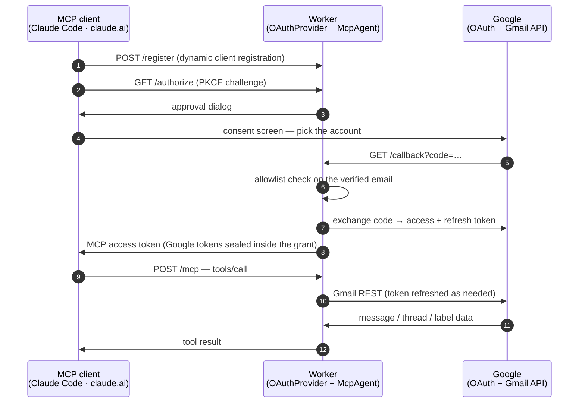
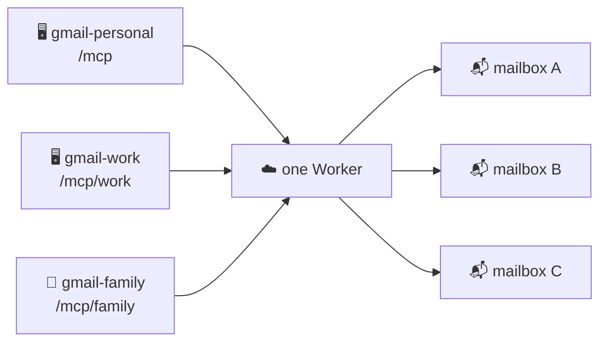

<div align="center">

<picture>
  <source media="(prefers-color-scheme: dark)" srcset="./docs/logo-dark.svg">
  <source media="(prefers-color-scheme: light)" srcset="./docs/logo-light.svg">
  
</picture>

**Your Gmail accounts, served to any MCP client, from your own Cloudflare Worker.**

[](https://developers.cloudflare.com/workers/)
[](https://modelcontextprotocol.io/)
[](https://datatracker.ietf.org/doc/html/draft-ietf-oauth-v2-1)
[](#-tools)
[](#-development)
[](./tsconfig.json)
[](./biome.json)
[](./LICENSE)

</div>

gmail-mcp is a remote [MCP](https://modelcontextprotocol.io/) server that exposes Gmail as 22 tools — search, read, label, draft, reply, send, attachments — over streamable HTTP with OAuth 2.1. It runs on Cloudflare Workers under your own domain, keeps its tokens in your own account, and decides who may sign in from a list you control.

**The multi-account model is the point.** Hosted Gmail connectors bind an assistant account to a single Google login. Here, every *connection* performs its own Google sign-in, so `work` and `personal` coexist as two connections of one deployment, each permanently bound to the mailbox chosen at its consent screen. Every tool description names the mailbox it acts on, so a model juggling both can never confuse them.

---

## 📑 Contents

- [How it works](#-how-it-works)
- [Tools](#-tools)
- [Compared with the alternatives](#-compared-with-the-alternatives)
- [Setup](#-setup)
- [Connecting clients](#-connecting-clients)
- [Security posture](#-security-posture)
- [Verified against live mailboxes](#-verified-against-live-mailboxes)
- [Development](#-development)

---

## 🏗 How it works

Two OAuth flows meet in one Worker. The MCP client authenticates *to* the Worker; the Worker authenticates *to* Google on your behalf. Neither side ever holds the other's credentials.



<div align="center">
<picture>
  <source media="(prefers-color-scheme: dark)" srcset="./docs/architecture-dark.svg">
  <source media="(prefers-color-scheme: light)" srcset="./docs/architecture-light.svg">
  
</picture>
</div>

| Layer | File | What it does |
| :-- | :-- | :-- |
| 🔐 MCP-side OAuth | [`workers-oauth-provider`](https://github.com/cloudflare/workers-oauth-provider) | Dynamic client registration, PKCE, grants in KV with the Google tokens sealed inside |
| 🔗 Google-side OAuth | `src/google-handler.ts` | Authorization code + offline access, one-time state bound to the browser session, double-submit CSRF, allowlist on the verified email |
| 🤖 Agent | `src/index.ts` | One Durable Object per MCP session; single-flight token refresh, 401 force-refresh, 429/503 backoff, throttled fan-out |
| ✉️ Mail | `src/gmail.ts` | RFC 822 construction, MIME tree walking, charset decoding, reply threading and quoting |

### Endpoints

| Path | Purpose |
| :-- | :-- |
| `/mcp` | MCP endpoint |
| `/mcp/<label>` | The same server under any single-segment label (`/mcp/work`, `/mcp/family`) — for clients that refuse two servers sharing a URL |
| `/authorize` · `/token` · `/register` · `/callback` | OAuth machinery |

---

## 🧰 Tools

<table>
<tr><th align="left">📖 Read</th><th align="left">✍️ Compose</th><th align="left">🏷 Organize</th></tr>
<tr valign="top">
<td>

`whoami`<br>
`search_messages`<br>
`get_message`<br>
`get_thread`<br>
`get_attachment`

</td>
<td>

`send_message`<br>
`reply_all`<br>
`create_draft`<br>
`update_draft`<br>
`send_draft`<br>
`delete_draft`<br>
`list_drafts`

</td>
<td>

`list_labels`<br>
`create_label`<br>
`update_label`<br>
`delete_label`<br>
`modify_labels`<br>
`modify_thread_labels`<br>
`batch_modify_messages`<br>
`trash_message` · `untrash_message`<br>
`trash_thread` · `untrash_thread`

</td>
</tr>
</table>

Composition covers what a real mail client sends: plain text, an HTML alternative, file attachments, and `cid:` inline images, nested as `multipart/mixed › multipart/related › multipart/alternative`. Subjects and filenames are RFC 2047 encoded, so 日本語 and emoji survive the trip. `reply_all` computes recipients from `Reply-To`/`From`/`To`/`Cc` minus your own address, carries the `References` chain, and quotes the original in both parts.

The granted scope is `gmail.modify`. Permanent deletion, filters, forwarding, and every other `gmail.settings.*` capability stay out of reach by construction — see [Security posture](#-security-posture).

---

## ⚖️ Compared with the alternatives

<div align="center">

</div>

| | **gmail-mcp** | Google's hosted<br>Gmail MCP | claude.ai<br>Gmail connector | Local stdio<br>MCP servers |
| :-- | :-: | :-: | :-: | :-: |
| Several accounts at once | ✅ one per connection | ❌ one per Claude account | ❌ one per Claude account | ⚠️ varies |
| Reachable from phone / web | ✅ | ✅ | ✅ | ❌ desktop only |
| Send mail | ✅ | ❌ read + draft only | ❌ read + draft only | ✅ |
| Attachments & inline images | ✅ | ❌ | ❌ | ⚠️ varies |
| `reply_all` with quoting | ✅ | ❌ | ❌ | ⚠️ varies |
| Tool count | **22** | ~10 | ~10 | varies |
| Who holds your refresh token | you | Google | Anthropic | your machine |
| Runs on | your Worker | Google | Anthropic | your machine |

---

## 🚀 Setup

Two consoles, roughly ten minutes. Everything scriptable is scripted; the clicking that remains exists because Google's OAuth consent screen has no API.

**Prerequisites** — a Cloudflare account with a domain on it, [bun](https://bun.sh), and a Google account. The same walkthrough, with copy buttons, is served at the root of any deployment (and in [`docs/index.html`](./docs/index.html)).

### 1 · Google Cloud — create the OAuth client

Most of this is one `gcloud` block. Install the [gcloud CLI](https://cloud.google.com/sdk/docs/install) and run:

```sh
PROJECT="gmail-mcp-$(openssl rand -hex 3)"
gcloud auth login
gcloud projects create "$PROJECT" --name="gmail-mcp"
gcloud config set project "$PROJECT"
gcloud services enable gmail.googleapis.com
```

The consent screen and the OAuth client itself must be created in the browser — Google exposes no API for either:

1. **APIs & Services → OAuth consent screen** → *External* → fill in an app name and your email.
   While the app is unverified, add every mailbox you plan to connect under **Test users**.
2. **APIs & Services → Credentials → Create credentials → OAuth client ID** → *Web application*.
   Add one authorized redirect URI, matching the domain you will deploy to:

   ```
   https://<your-domain>/callback
   ```

3. Copy the **client ID** and **client secret** — the next step consumes them.

> [!TIP]
> Adding `http://localhost:8788/callback` as a second redirect URI now saves a round trip later if you ever run `bun run dev`.

### 2 · Cloudflare — deploy

```sh
git clone https://github.com/mkpoli/gmail-mcp && cd gmail-mcp
bun install
```

Point the Worker at your own domain by editing `wrangler.jsonc` (`name`, and the `routes` pattern), then let the setup script create the KV namespace, prompt for each secret, and deploy:

```sh
bun run setup
```

<details>
<summary>What <code>bun run setup</code> does, if you would rather run it by hand</summary>

```sh
# 1. KV namespace for OAuth grants — put the printed id into wrangler.jsonc
bunx wrangler kv namespace create gmail-mcp-oauth

# 2. Secrets
bunx wrangler secret put GOOGLE_CLIENT_ID        # from step 1
bunx wrangler secret put GOOGLE_CLIENT_SECRET    # from step 1
openssl rand -hex 32 | bunx wrangler secret put COOKIE_ENCRYPTION_KEY
bunx wrangler secret put ALLOWED_EMAILS          # see below

# 3. Ship it
bun run deploy
```

</details>

### 3 · Decide who may sign in

`ALLOWED_EMAILS` is checked against the *verified* address Google reports, after consent and before any grant is issued:

| Value | Who gets in |
| :-- | :-- |
| *(empty)* | nobody — the default, fail-closed |
| `you@gmail.com, work@company.com` | exactly those accounts |
| `*@company.com` | any account in that domain |
| `*` | any verified Google account — the deployment becomes a public relay |

A grant only ever reaches the mailbox that authenticated it, so widening this list never widens access to accounts already connected. What `*` hands strangers is the use of *your* deployment and *your* Google OAuth client's quota for their own mail.

---

## 🔌 Connecting clients

No client ID, no client secret on the client side — MCP clients register themselves.

**Claude Code**

```sh
claude mcp add --transport http gmail-personal https://<your-domain>/mcp
claude mcp add --transport http gmail-work     https://<your-domain>/mcp/work
```

Then `/mcp` in Claude Code to authenticate each one, signing in with the matching Google account.

**claude.ai / Claude Desktop** — Settings → Connectors → *Add custom connector* → paste the URL, leave the credential fields empty. Add it a second time under a `/mcp/<label>` URL for a second mailbox.

**Anything else** — point it at `https://<your-domain>/mcp`; the server publishes its OAuth metadata at `/.well-known/oauth-authorization-server`.



---

## 🔒 Security posture

- **Access is exactly what `ALLOWED_EMAILS` says.** The MCP endpoint is public and clients self-register, so the allowlist is the gate. It is checked against Google's `verified_email`, and an empty setting admits nobody.
- **Isolation is per grant.** Each connection's Google tokens are sealed into its own grant; sessions are keyed by the MCP session header, not the URL. Verified live: a message id from one connected mailbox returns `404` on another connection of the same deployment.
- **Nothing is stored but tokens.** Mail passes through. Message content never touches KV, Durable Object storage, or logs. Refresh tokens are encrypted inside their grant; the hour-lived access token is cached in the session's Durable Object.
- **Injection defenses.** Every outgoing header value rejects CR/LF and NUL, closing the header-smuggling path from prompt-injected tool arguments — a hostile email cannot talk the model into adding a silent `Bcc`. Quoted history is HTML-escaped. Attachment payloads must be well-formed base64; `cid` values are charset-restricted.
- **Scope minimalism.** `gmail.modify` withholds `gmail.settings.*` and permanent delete, so the classic mailbox-backdoor vectors — auto-forwarding rules, filter exfiltration — are outside what any stolen grant could do.
- **Bounded output.** Message and thread bodies have character budgets, attachments a size cap, so no mailbox can flood the client that reads it.
- **Revocation.** Narrow `ALLOWED_EMAILS` to stop new sign-ins; revoke at [myaccount.google.com/connections](https://myaccount.google.com/connections), or rotate the Google client secret to invalidate every existing grant.

> [!IMPORTANT]
> The trust boundary, stated plainly: the Worker decrypts mail in memory while serving a request, as any hosted relay must. If that is unacceptable for your mail, run the client on your own hardware.

---

## ✅ Verified against live mailboxes

Every tool has run end-to-end between real Gmail accounts, with an independent account checking what actually arrived.

| Area | What was confirmed |
| :-- | :-- |
| 🌏 Encoding | Japanese subjects via RFC 2047; emoji, ZWJ sequences, RTL Arabic, combining marks, Ainu small kana, CJK and math symbols round-tripped exactly |
| 📎 Attachments | CSV with a Japanese filename sent, delivered, and downloaded back byte-identical; `cid:` inline image rendered by the recipient |
| 🧵 Threading | `reply_all` addressed the sender, kept the third-party `Cc`, dropped its own account, preserved the thread, and quoted the original |
| 🔀 Multi-account | Two mailboxes connected to one deployment at once; a message id from one returned `404` on the other |
| 🏷 Organizing | Nested CJK label created, renamed, applied by batch across messages, and deleted; thread and message trash both reversed cleanly |
| 📇 Scale | A ~15k-message mailbox searched with Gmail operators and pagination, at eight concurrent metadata fetches, without tripping a rate limit |
| 🧯 Failure modes | Invalid ids return structured errors; oversized bodies truncate with a marker rather than flooding the client |

---

## 🛠 Development

```sh
bun run dev     # wrangler dev on :8788
bun run check   # biome + tsc --noEmit
bun test        # 52 unit tests
bun run deploy
```

Tests cover the RFC 822 builder (nesting order, CRLF rejection, RFC 2047, 76-column wrapping), MIME extraction with charsets, reply helpers, the Google token flows, and the allowlist matcher.

---

## 📄 License

[MIT](./LICENSE). `src/workers-oauth-utils.ts` is vendored from Cloudflare's [remote-mcp-github-oauth demo](https://github.com/cloudflare/ai/tree/main/demos/remote-mcp-github-oauth) (MIT).

<sub>Diagram variants for light and dark themes are generated with `bun run assets`.</sub>
