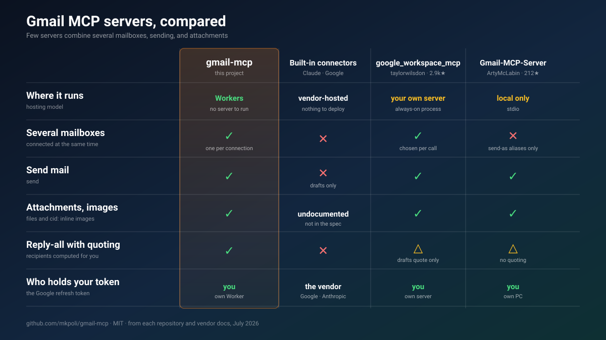
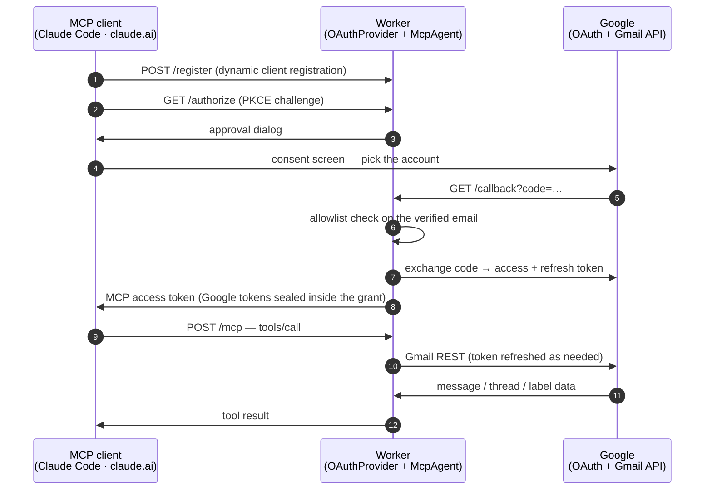

<div align="center">

<picture>
  <source media="(prefers-color-scheme: dark)" srcset="./docs/logo-dark.svg">
  <source media="(prefers-color-scheme: light)" srcset="./docs/logo-light.svg">
  
</picture>

**Gmail for your AI assistant — several accounts at once, on a server you own.**

[](./LICENSE)
[](https://developers.cloudflare.com/workers/)
[](https://modelcontextprotocol.io/)
[](https://datatracker.ietf.org/doc/html/draft-ietf-oauth-v2-1)
[](#what-it-can-do)
[](#how-it-was-tested)

*[日本語版](./README.ja.md) · [简体中文](./README.zh.md)*

</div>

<p align="center">
<picture>
  <source media="(prefers-color-scheme: dark)" srcset="./docs/demo-dark.svg">
  <source media="(prefers-color-scheme: light)" srcset="./docs/demo-light.svg">
  
</picture>
</p>

**gmail-mcp** connects Gmail to Claude and any other [MCP](https://modelcontextprotocol.io/) client. It can **search and read** mail, **send and reply-all** with quoted history, **forward**, handle **attachments and inline images**, and manage drafts, labels, and threads — across **several Google accounts at the same time**.

It runs as a remote server on **your own Cloudflare Worker**, so the same connection answers from Claude Code on a laptop, claude.ai in a browser, and Claude on a phone. Each connection signs in to **one** Google account, and the Google refresh token stays in **your** Cloudflare account.

Two things push people here. The Gmail connectors built into Claude and Google read mail and write drafts, but **cannot send**, and hold one Google account per assistant account. Servers that can send are usually local processes — fine at a desk, invisible from a phone.

---

## How it compares

<p align="center">

</p>

<details>
<summary><b>A longer comparison</b> — six projects, twelve rows</summary>

<br>

| | **gmail-mcp** | [Claude](https://claude.com/connectors/gmail) · [Google](https://developers.google.com/workspace/gmail/api/guides/configure-mcp-server) built-in | [taylorwilsdon/<br>google_workspace_mcp](https://github.com/taylorwilsdon/google_workspace_mcp) | [ArtyMcLabin/<br>Gmail-MCP-Server](https://github.com/ArtyMcLabin/Gmail-MCP-Server) | [shinzo-labs/<br>gmail-mcp](https://github.com/shinzo-labs/gmail-mcp) | [aaronsb/<br>google-workspace-mcp](https://github.com/aaronsb/google-workspace-mcp) |
| :-- | :-: | :-: | :-: | :-: | :-: | :-: |
| Where it runs | Cloudflare Workers | vendor-hosted | your server or local | local | local | local |
| Reachable from a phone | ✅ | ✅ | ✅ | ❌ | ❌ | ❌ |
| Several mailboxes at once | ✅ bound per connection | ❌ | ✅ chosen per call | ❌ aliases only | ❌ | ✅ chosen per call |
| Send mail | ✅ | ❌ | ✅ | ✅ | ✅ | ✅ |
| Attachments · inline `cid:` images | ✅ | undocumented | ✅ | ✅ | ❌ | ✅ |
| Reply-all with quoted history | ✅ | ❌ | drafts only | no quoting | ❌ | ✅ |
| Forward | ✅ | ❌ | ✅ | ❌ | ❌ | ✅ |
| Honors each part's charset | ✅ | — | ❌ UTF-8 assumed | ❌ UTF-8 assumed | ❌ | ❌ |
| Rejects CRLF header injection | ✅ | — | ✅ framework | ✅ strips | ❌ **none** | ✅ |
| Mailbox settings (filters, vacation) | ❌ out of scope | ❌ | filters | filters | ✅ | ❌ |
| Tool count | 24 | 11–16 | 14 (Gmail) | 30 | 64 | 11 |
| Who holds your refresh token | you | vendor | you | you | you | you |

[`google_workspace_mcp`](https://github.com/taylorwilsdon/google_workspace_mcp) is the most complete project here. It covers all of Workspace rather than Gmail alone, and it appends your Gmail signature and pulls attachments straight from a URL, neither of which gmail-mcp does. [`shinzo-labs/gmail-mcp`](https://github.com/shinzo-labs/gmail-mcp) reaches vacation responders, delegates, and S/MIME through its 64 tools; those live under `gmail.settings.*`, a scope gmail-mcp never requests, so they stay beyond its reach whatever happens to a grant.

Two design differences decide most of the rest. Routing accounts by a call argument lets one grant touch every connected mailbox, while binding the mailbox to the connection means a wrong argument reaches nothing. And on reading, the local servers decode every part as UTF-8: ISO-2022-JP and Shift_JIS mail arrives garbled, and long messages that Gmail stores as attachment blobs come back with an empty body.

</details>

---

## Deploy it

About ten minutes. You need a Cloudflare account, [bun](https://bun.sh), and a Google account. A domain on the Cloudflare account is optional — without one the Worker answers on `workers.dev`.

### 1 · Create a Google OAuth client

```sh
PROJECT="gmail-mcp-$(openssl rand -hex 3)"
gcloud auth login
gcloud projects create "$PROJECT" --name="gmail-mcp"
gcloud config set project "$PROJECT"
gcloud services enable gmail.googleapis.com
```

Google exposes no API for the next two steps, so they happen in the [Cloud console](https://console.cloud.google.com/):

- [**OAuth consent screen**](https://console.cloud.google.com/auth/overview) → *External*, then under **Audience** press **Publish app**. Left in Testing, Google expires every refresh token after 7 days and each connection dies with its token. Published, the app shows an unverified-app warning at sign-in and serves up to 100 accounts.
- [**Credentials**](https://console.cloud.google.com/apis/credentials) **→ Create credentials → OAuth client ID** → *Web application*, with `https://<your-host>/callback` as an authorized redirect URI. Keep the client ID and secret.

`<your-host>` is the domain you point at the Worker, or the `workers.dev` hostname it gets otherwise. Deploying first and coming back to fill this in works — the guide the Worker serves at `/` shows the exact value.

### 2 · Deploy the Worker

[](https://deploy.workers.cloudflare.com/?url=https://github.com/mkpoli/gmail-mcp)

The button copies the repository into your GitHub account, creates the KV namespace and the Durable Object, and asks for the four secrets. It deploys to `workers.dev`; a custom domain is attached afterwards under **Settings → Domains & Routes**.

From a terminal instead:

```sh
git clone https://github.com/mkpoli/gmail-mcp && cd gmail-mcp
bun install
bun run setup
```

`bun run setup` asks which domain to answer on, creates or reuses the `OAUTH_KV` namespace, takes the client ID and secret, generates a cookie key, and deploys. Those first two answers land in `wrangler.local.jsonc`, which git ignores — `wrangler.jsonc` names no account's namespace and no one's domain, so a clone deploys anywhere. Re-running setup to rotate a single secret is safe.

### 3 · Connect a client

Leave the client ID and secret fields empty — MCP clients register themselves.

```sh
claude mcp add --transport http gmail-personal https://<your-host>/mcp
claude mcp add --transport http gmail-work     https://<your-host>/mcp/work
```

Run `/mcp` in Claude Code to sign each connection in to its Google account. In claude.ai it is **Settings → Connectors → Add custom connector** with the same URL. Any single-segment label works after `/mcp/`, which is how one deployment serves several mailboxes to clients that reject two servers sharing a URL.

Your deployment serves this guide at `https://<your-host>/`.

---

## What it can do

<table>
<tr><th align="left">📖 Read</th><th align="left">✍️ Write</th><th align="left">🏷 Organize</th></tr>
<tr valign="top">
<td>

`whoami`<br>
`search_messages`<br>
`get_message`<br>
`get_thread`<br>
`get_attachment`

</td>
<td>

`send_message`<br>
`reply_all`<br>
`forward_message`<br>
`create_draft`<br>
`update_draft`<br>
`send_draft`<br>
`delete_draft`<br>
`list_drafts`<br>
`stage_attachment_begin`<br>
`stage_attachment_append`<br>
`stage_attachment_finish`

</td>
<td>

`list_labels`<br>
`create_label`<br>
`update_label`<br>
`delete_label`<br>
`modify_labels`<br>
`modify_thread_labels`<br>
`batch_modify_messages`<br>
`trash_message` · `untrash_message`<br>
`trash_thread` · `untrash_thread`

</td>
</tr>
</table>

Messages leave the way a mail client sends them: plain text with an HTML alternative, file attachments, and inline images referenced by `cid:`, nested as `multipart/mixed › multipart/related › multipart/alternative`. Subjects and display names use RFC 2047, filenames use RFC 2231, so Japanese, Chinese, and emoji survive the trip.

`reply_all` reads the original's `Reply-To`, `From`, `To`, and `Cc`, drops your own address and any address you send mail as, answers from the one the sender wrote to, carries the `References` chain, and quotes the original in whichever parts you send. `forward_message` reproduces the forwarded envelope and can re-attach the original's files.

`create_draft` with `replyToMessageId` writes the reply as a draft to edit before sending: it joins the original's thread, carries `In-Reply-To` and `References`, derives the reply-all recipients and the `Re:` subject, and quotes the original. `update_draft` changes only the fields it is given; recipients, text, files added by hand in any client, and the thread the draft answers are read back and kept. A file whose base64 will not fit through tool arguments is staged instead: `stage_attachment_begin` returns an upload URL that takes the raw bytes in one `curl -T`, `stage_attachment_append` takes base64 in chunks, and every `attachments` field accepts the resulting `stagingId`.

Reading is bounded on purpose: message and thread bodies have character budgets, a whole response has a byte ceiling, and an attachment is returned inline only while it stays small enough to read. A long mailing-list thread, or a large file, comes back trimmed with a note saying so rather than filling the assistant's context.

---

## How it works

Two OAuth flows meet in one Worker. The MCP client authenticates *to* the Worker; the Worker authenticates *to* Google on your behalf. Neither side holds the other's credentials.



<p align="center">
<picture>
  <source media="(prefers-color-scheme: dark)" srcset="./docs/architecture-dark.svg">
  <source media="(prefers-color-scheme: light)" srcset="./docs/architecture-light.svg">
  
</picture>
</p>

| Layer | File | What it does |
| :-- | :-- | :-- |
| 🔐 MCP-side OAuth | [`workers-oauth-provider`](https://github.com/cloudflare/workers-oauth-provider) | Dynamic client registration, PKCE, grants in KV with the Google tokens sealed inside |
| 🔗 Google-side OAuth | `src/google-handler.ts` | Authorization code with offline access, one-time state bound to the browser session, double-submit CSRF, allowlist on the verified email |
| 🤖 Agent | `src/index.ts` | One Durable Object per MCP session, bound to the account that opened it; single-flight token refresh, throttled fan-out |
| ✉️ Mail | `src/gmail.ts` | RFC 822 construction, MIME tree walking, charset decoding, reply and forward composition |

### Built with

- **[TypeScript](https://www.typescriptlang.org/) on [Cloudflare Workers](https://developers.cloudflare.com/workers/)** — Durable Objects hold one MCP session each, KV holds the OAuth grants
- **[Hono](https://hono.dev/)** — routing for the OAuth endpoints, the Google callback, and the setup page at `/`
- **[`@cloudflare/workers-oauth-provider`](https://github.com/cloudflare/workers-oauth-provider)** — the OAuth 2.1 server that MCP clients register against
- **[`agents`](https://github.com/cloudflare/agents)** — `McpAgent`, the MCP transport over Durable Objects
- **[`@modelcontextprotocol/sdk`](https://github.com/modelcontextprotocol/typescript-sdk)** with **[Zod](https://zod.dev/)** — tool definitions and argument validation
- **[Bun](https://bun.sh/)**, **[Biome](https://biomejs.dev/)**, **[Wrangler](https://developers.cloudflare.com/workers/wrangler/)** — install, test, lint, deploy

Gmail itself is called over plain `fetch` against the [REST API](https://developers.google.com/workspace/gmail/api/reference/rest). The official `googleapis` SDK assumes Node and carries far more than a Worker should ship, so message building, MIME parsing, and token refresh live in `src/gmail.ts` and `src/utils.ts` instead.

### Endpoints

| Path | Purpose |
| :-- | :-- |
| `/mcp` | MCP endpoint |
| `/mcp/<label>` | The same server under any single-segment label, for clients that reject two servers sharing a URL |
| `/` | This setup guide |
| `/authorize` · `/token` · `/register` · `/callback` | OAuth machinery |

---

## Who can sign in

`ALLOWED_EMAILS` decides, checked against the address Google reports as verified — after consent, before any grant exists.

| Value | Who gets in |
| :-- | :-- |
| *(empty)* | nobody |
| `you@gmail.com, work@company.com` | those accounts |
| `*@company.com` | anyone in that domain |
| `*` | any verified Google account |

Each grant reaches only the mailbox that authenticated it, so widening this list never widens access to mailboxes already connected. Setting `*` lets strangers use your deployment, and your Google client's quota, for their own mail.

---

## Limits

Two ceilings keep a shared deployment from being drained, both set in `wrangler.jsonc`:

| Setting | Where | Default | What it bounds |
| :-- | :-- | :-- | :-- |
| `MAX_ACCOUNTS` | `vars` | `25` | Roughly how many distinct Google accounts may ever complete sign-in. Accounts already connected keep working when the cap is reached; new ones are turned away. Sign-ins arriving together each read the count before any of them is recorded, so the total can settle a little above this number. Google caps unverified apps at 100 users, so leave room below that. |
| `RATE_LIMITER.simple.limit` | `unsafe.bindings` | `120` per `60`s | Gmail calls one account may make in that window, across all of its sessions. Cloudflare keeps this count per location, so an account connecting from two regions gets roughly that many in each. A wide read spends several: `search_messages` returning 50 makes 51 calls. |
| `REGISTER_LIMITER.simple.limit` | `unsafe.bindings` | `10` per `60`s | Client registrations one address may make in that window. A client registers once and keeps the id it is given, so ordinary use never approaches this; the ceiling is there because registration needs no credentials and each one writes to KV. |

On the Workers **Free** plan a further ceiling applies: 50 outbound requests per invocation. A wide read spends one per message, so `search_messages` and `list_drafts` want `maxResults` at 45 or below there; above it the surplus comes back as per-message errors rather than results. The paid plan allows 1000.

Raise either and redeploy. Cloudflare's rate limiter reads its ceiling from the
binding at build time, so the `simple.limit` on each is the only place that
changes it. A
single-user deployment can leave both alone — normal assistant use sits far
below them.

---

## Security

Self-hosting moves the trust question rather than removing it, so here is where everything sits.

- **Your tokens stay yours.** Refresh tokens are encrypted inside their OAuth grant in your KV namespace. A session's Durable Object holds the hour-lived access token, and the MCP agent framework keeps a copy of the grant there for as long as the object lives, refresh token included. Both stores are your own Cloudflare account, encrypted at rest. Mail is never stored — it passes through.
- **One session, one mailbox.** The MCP session is bound to the account that opened it, so a grant for one mailbox cannot act on another through a borrowed session id.
- **Scope minimalism.** `gmail.modify` covers reading, sending, labels, and trash. It excludes permanent deletion and all of `gmail.settings.*`, keeping auto-forwarding rules and filter exfiltration — the classic mailbox backdoors — outside what any stolen grant could do. Two read-only scopes are requested alongside it, `userinfo.email` and `userinfo.profile`: they are how the allowlist and the session binding know which account signed in, and they reach no mail.
- **Headers cannot be smuggled.** Every outgoing header value is rejected if it contains CR, LF or NUL, so no argument can break out of its own field to append one — a `Bcc` inside a subject line, say. Media types are validated, and quoted history is HTML-escaped. What this does not do is police the arguments themselves: `bcc` is a real parameter, so a model acting on an instruction hidden in a message body could still fill it in, and your client's approval prompt remains the check on that.
- **Access can be withdrawn.** Narrowing `ALLOWED_EMAILS` stops new sign-ins. A single account's access is revoked at [myaccount.google.com/connections](https://myaccount.google.com/connections). Rotating the Google client secret invalidates every grant at once.

The Worker decrypts mail in memory while serving a request, as any hosted relay must. If that is unacceptable for a particular mailbox, run a local MCP server for that one.

---

## How it was tested

253 unit tests cover message construction (MIME nesting, RFC 2047 folding, RFC 2231 filenames, CR/LF rejection, base64 wrapping), body extraction across charsets, reply and forward composition, the Google token flows, the sign-in allowlist, the CSRF and state-binding checks that guard the browser side of sign-in, and the tools themselves against a stand-in Gmail — session ownership, recipient composition, attachment selection, and what a partly-failed read returns.

Beyond that, every tool has run against real Gmail accounts, with a separate account checking what arrived:

| Area | Result |
| :-- | :-- |
| Encoding | Japanese subjects folded across encoded words; emoji, ZWJ sequences, RTL Arabic, combining marks, and rare CJK round-tripped unchanged |
| Attachments | A CSV named `請求書.csv` sent, delivered, and downloaded back byte-identical; an inline `cid:` image rendered by the recipient |
| Threading | `reply_all` addressed the sender, kept the third-party `Cc`, dropped its own address, and quoted the original in the same thread |
| Two accounts | Both connected to one deployment at once; a message id from one returned `404` on the other |
| Organizing | A nested CJK label created, renamed, applied by batch, and deleted; thread and message trash both reversed |
| Scale | A 15,000-message mailbox searched with Gmail operators and pagination without tripping a rate limit |

---

## Development

```sh
bun run dev     # wrangler dev on :8788
bun run check   # biome + tsc
bun test        # 253 unit tests
bun run assets  # regenerate the light and dark diagrams
bun run deploy
```

## Questions and bugs

Open an [issue](https://github.com/mkpoli/gmail-mcp/issues).

---

## License

Copyright © 2026 mkpoli. Released under the [MIT License](./LICENSE).

`src/workers-oauth-utils.ts` is derived from the [remote-mcp-github-oauth demo](https://github.com/cloudflare/ai/tree/main/demos/remote-mcp-github-oauth) in [cloudflare/ai](https://github.com/cloudflare/ai), Copyright © 2025 Cloudflare, Inc., used under the MIT License. See [THIRD-PARTY.md](./THIRD-PARTY.md).
