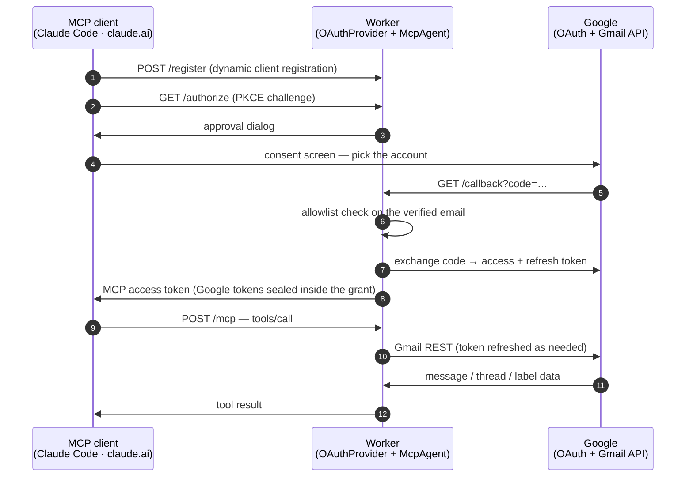

<div align="center">

<picture>
  <source media="(prefers-color-scheme: dark)" srcset="./docs/logo-dark.svg">
  <source media="(prefers-color-scheme: light)" srcset="./docs/logo-light.svg">
  
</picture>

**Gmail for your AI assistant — several accounts at once, on a server you own.**

[](./LICENSE)
[](https://developers.cloudflare.com/workers/)
[](https://modelcontextprotocol.io/)
[](https://datatracker.ietf.org/doc/html/draft-ietf-oauth-v2-1)
[](#what-it-can-do)
[](#how-it-was-tested)

*[日本語版はこちら](./README.ja.md)*

</div>

**gmail-mcp** connects Gmail to Claude and any other [MCP](https://modelcontextprotocol.io/) client. It can **search and read** mail, **send and reply-all** with quoted history, **forward**, handle **attachments and inline images**, and manage drafts, labels, and threads — across **several Google accounts at the same time**.

It runs as a remote server on **your own Cloudflare Worker**, so the same connection answers from Claude Code on a laptop, claude.ai in a browser, and Claude on a phone. Each connection signs in to **one** Google account, and the Google refresh token stays in **your** Cloudflare account.

Two things push people here. The Gmail connectors built into Claude and Google read mail and write drafts, but **cannot send**, and hold one Google account per assistant account. Servers that can send are usually local processes — fine at a desk, invisible from a phone.

---

## How it compares

<div align="center">

</div>

<details>
<summary><b>The same comparison in detail</b>, including where the alternatives are stronger</summary>

<br>

| | **gmail-mcp** | [Claude](https://claude.com/connectors/gmail) · [Google](https://developers.google.com/workspace/gmail/api/guides/configure-mcp-server) built-in | [taylorwilsdon/<br>google_workspace_mcp](https://github.com/taylorwilsdon/google_workspace_mcp) | [ArtyMcLabin/<br>Gmail-MCP-Server](https://github.com/ArtyMcLabin/Gmail-MCP-Server) | [shinzo-labs/<br>gmail-mcp](https://github.com/shinzo-labs/gmail-mcp) | [aaronsb/<br>google-workspace-mcp](https://github.com/aaronsb/google-workspace-mcp) |
| :-- | :-: | :-: | :-: | :-: | :-: | :-: |
| Where it runs | Cloudflare Workers | vendor-hosted | your server or local | local | local | local |
| Reachable from a phone | ✅ | ✅ | ✅ | ❌ | ❌ | ❌ |
| Several mailboxes at once | ✅ bound per connection | ❌ | ✅ chosen per call | ❌ aliases only | ❌ | ✅ chosen per call |
| Send mail | ✅ | ❌ | ✅ | ✅ | ✅ | ✅ |
| Attachments · inline `cid:` images | ✅ | undocumented | ✅ | ✅ | ❌ | ✅ |
| Reply-all with quoted history | ✅ | ❌ | drafts only | no quoting | ❌ | ✅ |
| Forward | ✅ | ❌ | ✅ | ❌ | ❌ | ✅ |
| Honors each part's charset | ✅ | — | ❌ UTF-8 assumed | ❌ UTF-8 assumed | ❌ | ❌ |
| Rejects CRLF header injection | ✅ | — | ✅ framework | ✅ strips | ❌ **none** | ✅ |
| Mailbox settings (filters, vacation) | ❌ out of scope | ❌ | filters | filters | ✅ | ❌ |
| Tool count | 23 | 11–16 | 14 (Gmail) | 30 | 64 | 11 |
| Who holds your refresh token | you | vendor | you | you | you | you |

**Where the others win.** [`google_workspace_mcp`](https://github.com/taylorwilsdon/google_workspace_mcp) is the most complete project in this space and covers all of Workspace, with Gmail signatures and URL-sourced attachments that gmail-mcp lacks. [`shinzo-labs/gmail-mcp`](https://github.com/shinzo-labs/gmail-mcp) reaches vacation responders, delegates, and S/MIME through 64 tools; gmail-mcp keeps `gmail.settings.*` outside its OAuth scope on purpose, so those are permanently out of its reach. Both it and [`Gmail-MCP-Server`](https://github.com/ArtyMcLabin/Gmail-MCP-Server) encode non-ASCII attachment filenames the same way gmail-mcp does since v0.2.

**Where the difference matters.** Multi-account routing by call argument means one grant can touch every connected mailbox; gmail-mcp binds a mailbox to the connection, so a wrong argument cannot reach the wrong inbox. On reading, both local servers assume UTF-8 regardless of the part's declared charset, so ISO-2022-JP and Shift_JIS mail arrives garbled, and neither fetches the text of long messages that Gmail stores as attachment blobs.

</details>

---

## Deploy it

About ten minutes. You need a Cloudflare account with a domain on it, [bun](https://bun.sh), and a Google account.

### 1 · Create a Google OAuth client

```sh
PROJECT="gmail-mcp-$(openssl rand -hex 3)"
gcloud auth login
gcloud projects create "$PROJECT" --name="gmail-mcp"
gcloud config set project "$PROJECT"
gcloud services enable gmail.googleapis.com
```

Google exposes no API for the next two steps, so they happen in the console:

- **OAuth consent screen** → *External*. While the app is unverified, add each mailbox you plan to connect under **Test users**.
- **Credentials → Create credentials → OAuth client ID** → *Web application*, with `https://<your-domain>/callback` as an authorized redirect URI. Keep the client ID and secret.

### 2 · Deploy the Worker

```sh
git clone https://github.com/mkpoli/gmail-mcp && cd gmail-mcp
bun install
# in wrangler.jsonc, set `name` and the routes `pattern` to your domain
bun run setup
```

`bun run setup` creates the KV namespace, asks for the client ID and secret, generates a cookie key, and deploys. Re-running it to rotate a single secret is safe.

### 3 · Connect a client

Leave the client ID and secret fields empty — MCP clients register themselves.

```sh
claude mcp add --transport http gmail-personal https://<your-domain>/mcp
claude mcp add --transport http gmail-work     https://<your-domain>/mcp/work
```

Run `/mcp` in Claude Code to sign each connection in to its Google account. In claude.ai it is **Settings → Connectors → Add custom connector** with the same URL. Any single-segment label works after `/mcp/`, which is how one deployment serves several mailboxes to clients that reject two servers sharing a URL.

Your deployment serves this guide at `https://<your-domain>/`.

---

## What it can do

<table>
<tr><th align="left">📖 Read</th><th align="left">✍️ Write</th><th align="left">🏷 Organize</th></tr>
<tr valign="top">
<td>

`whoami`<br>
`search_messages`<br>
`get_message`<br>
`get_thread`<br>
`get_attachment`

</td>
<td>

`send_message`<br>
`reply_all`<br>
`forward_message`<br>
`create_draft`<br>
`update_draft`<br>
`send_draft`<br>
`delete_draft`<br>
`list_drafts`

</td>
<td>

`list_labels`<br>
`create_label`<br>
`update_label`<br>
`delete_label`<br>
`modify_labels`<br>
`modify_thread_labels`<br>
`batch_modify_messages`<br>
`trash_message` · `untrash_message`<br>
`trash_thread` · `untrash_thread`

</td>
</tr>
</table>

Messages leave the way a mail client sends them: plain text with an HTML alternative, file attachments, and inline images referenced by `cid:`, nested as `multipart/mixed › multipart/related › multipart/alternative`. Subjects and display names use RFC 2047, filenames use RFC 2231, so Japanese, Chinese, and emoji survive the trip.

`reply_all` reads the original's `Reply-To`, `From`, `To`, and `Cc`, drops your own address, carries the `References` chain, and quotes the original in both parts. `forward_message` reproduces the forwarded envelope and can re-attach the original's files.

Reading is bounded on purpose: message and thread bodies have character budgets and attachments a size ceiling, so a mailing-list thread cannot flood the assistant's context.

---

## How it works

Two OAuth flows meet in one Worker. The MCP client authenticates *to* the Worker; the Worker authenticates *to* Google on your behalf. Neither side holds the other's credentials.



<div align="center">
<picture>
  <source media="(prefers-color-scheme: dark)" srcset="./docs/architecture-dark.svg">
  <source media="(prefers-color-scheme: light)" srcset="./docs/architecture-light.svg">
  
</picture>
</div>

| Layer | File | What it does |
| :-- | :-- | :-- |
| 🔐 MCP-side OAuth | [`workers-oauth-provider`](https://github.com/cloudflare/workers-oauth-provider) | Dynamic client registration, PKCE, grants in KV with the Google tokens sealed inside |
| 🔗 Google-side OAuth | `src/google-handler.ts` | Authorization code with offline access, one-time state bound to the browser session, double-submit CSRF, allowlist on the verified email |
| 🤖 Agent | `src/index.ts` | One Durable Object per MCP session, bound to the account that opened it; single-flight token refresh, throttled fan-out |
| ✉️ Mail | `src/gmail.ts` | RFC 822 construction, MIME tree walking, charset decoding, reply and forward composition |

### Endpoints

| Path | Purpose |
| :-- | :-- |
| `/mcp` | MCP endpoint |
| `/mcp/<label>` | The same server under any single-segment label, for clients that reject two servers sharing a URL |
| `/` | This setup guide |
| `/authorize` · `/token` · `/register` · `/callback` | OAuth machinery |

---

## Who can sign in

`ALLOWED_EMAILS` decides, checked against the address Google reports as verified — after consent, before any grant exists.

| Value | Who gets in |
| :-- | :-- |
| *(empty)* | nobody |
| `you@gmail.com, work@company.com` | those accounts |
| `*@company.com` | anyone in that domain |
| `*` | any verified Google account |

Each grant reaches only the mailbox that authenticated it, so widening this list never widens access to mailboxes already connected. Setting `*` lets strangers use your deployment, and your Google client's quota, for their own mail.

---

## Security

Self-hosting moves the trust question rather than removing it, so here is where everything sits.

- **Your tokens stay yours.** Refresh tokens are encrypted inside their OAuth grant in your KV namespace; the hour-lived access token lives in the session's Durable Object. Mail is never stored — it passes through.
- **One session, one mailbox.** The MCP session is bound to the account that opened it, so a grant for one mailbox cannot act on another through a borrowed session id.
- **Scope minimalism.** `gmail.modify` covers reading, sending, labels, and trash. It excludes permanent deletion and all of `gmail.settings.*`, keeping auto-forwarding rules and filter exfiltration — the classic mailbox backdoors — outside what any stolen grant could do.
- **Hostile mail cannot smuggle headers.** Every outgoing header value rejects CR and LF, so an instruction hidden in a message body cannot add a silent `Bcc`. Media types are validated, and quoted history is HTML-escaped.
- **Revoking works.** Narrow `ALLOWED_EMAILS` to stop new sign-ins, revoke at [myaccount.google.com/connections](https://myaccount.google.com/connections), or rotate the Google client secret to invalidate every grant at once.

The Worker decrypts mail in memory while serving a request, as any hosted relay must. If that is unacceptable for a particular mailbox, run a local MCP server for that one.

---

## How it was tested

61 unit tests cover message construction (MIME nesting, RFC 2047 folding, RFC 2231 filenames, CR/LF rejection, base64 wrapping), body extraction across charsets, reply and forward composition, the Google token flows, and the sign-in allowlist.

Beyond that, every tool has run against real Gmail accounts, with a separate account checking what arrived:

| Area | Result |
| :-- | :-- |
| Encoding | Japanese subjects folded across encoded words; emoji, ZWJ sequences, RTL Arabic, combining marks, and Ainu small kana round-tripped unchanged |
| Attachments | A CSV named `品詞リスト.csv` sent, delivered, and downloaded back byte-identical; an inline `cid:` image rendered by the recipient |
| Threading | `reply_all` addressed the sender, kept the third-party `Cc`, dropped its own address, and quoted the original in the same thread |
| Two accounts | Both connected to one deployment at once; a message id from one returned `404` on the other |
| Organizing | A nested CJK label created, renamed, applied by batch, and deleted; thread and message trash both reversed |
| Scale | A 15,000-message mailbox searched with Gmail operators and pagination without tripping a rate limit |

---

## Development

```sh
bun run dev     # wrangler dev on :8788
bun run check   # biome + tsc
bun test        # 61 unit tests
bun run assets  # regenerate the light and dark diagrams
bun run deploy
```

## License

[MIT](./LICENSE). `src/workers-oauth-utils.ts` comes from Cloudflare's [remote-mcp-github-oauth demo](https://github.com/cloudflare/ai/tree/main/demos/remote-mcp-github-oauth) (MIT).
