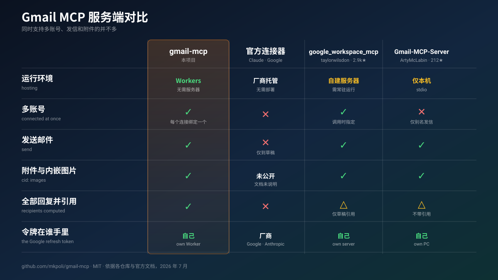
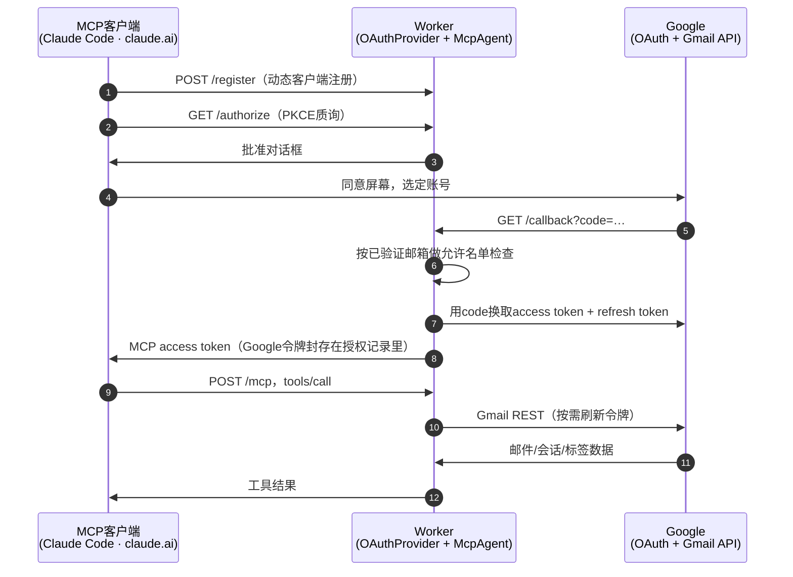

# gmail-mcp

[](./LICENSE)
[](https://developers.cloudflare.com/workers/)
[](https://modelcontextprotocol.io/)
[](https://datatracker.ietf.org/doc/html/draft-ietf-oauth-v2-1)
[](#能做什么)
[](#测试)

*[English README](./README.md) · [日本語版](./README.ja.md)*

<p align="center">
<picture>
  <source media="(prefers-color-scheme: dark)" srcset="./docs/demo.zh-dark.svg">
  <source media="(prefers-color-scheme: light)" srcset="./docs/demo.zh-light.svg">
  
</picture>
</p>

**gmail-mcp**是一个把Gmail接入Claude等MCP客户端的工具，可以同时连接多个Google账号，支持搜索、阅读、发送、全部回复、转发，以及附件和内嵌图片。

服务跑在你自己的Cloudflare Worker上，笔记本上的Claude Code、浏览器里的claude.ai、手机上的Claude连的都是同一个地址。每条连接登录一个Google账号，refresh token保存在你自己的Cloudflare账号里。

---

## 方案对比

<p align="center">

</p>

<details>
<summary><b>更完整的对比</b>——六个项目，十二行</summary>

<br>

| | **gmail-mcp** | [Claude](https://claude.com/connectors/gmail) · [Google](https://developers.google.com/workspace/gmail/api/guides/configure-mcp-server)内置 | [taylorwilsdon/<br>google_workspace_mcp](https://github.com/taylorwilsdon/google_workspace_mcp) | [ArtyMcLabin/<br>Gmail-MCP-Server](https://github.com/ArtyMcLabin/Gmail-MCP-Server) | [shinzo-labs/<br>gmail-mcp](https://github.com/shinzo-labs/gmail-mcp) | [aaronsb/<br>google-workspace-mcp](https://github.com/aaronsb/google-workspace-mcp) |
| :-- | :-: | :-: | :-: | :-: | :-: | :-: |
| 运行位置 | Cloudflare Workers | 厂商托管 | 自有服务器或本地 | 本地 | 本地 | 本地 |
| 手机上可达 | ✅ | ✅ | ✅ | ❌ | ❌ | ❌ |
| 同时多个邮箱 | ✅ 按连接绑定 | ❌ | ✅ 调用时指定 | ❌ 仅别名 | ❌ | ✅ 调用时指定 |
| 发信 | ✅ | ❌ | ✅ | ✅ | ✅ | ✅ |
| 附件 · `cid:`内嵌图片 | ✅ | 未公开 | ✅ | ✅ | ❌ | ✅ |
| 全部回复并引用原文 | ✅ | ❌ | 仅草稿 | 无引用 | ❌ | ✅ |
| 转发 | ✅ | ❌ | ✅ | ❌ | ❌ | ✅ |
| 按part声明的字符集解码 | ✅ | — | ❌ 假定UTF-8 | ❌ 假定UTF-8 | ❌ | ❌ |
| 拒绝CRLF头注入 | ✅ | — | ✅ 框架层 | ✅ 剥离 | ❌ **无** | ✅ |
| 邮箱设置（过滤器、休假回复） | ❌ 范围外 | ❌ | 过滤器 | 过滤器 | ✅ | ❌ |
| 工具数量 | 24 | 11–16 | 14（Gmail） | 30 | 64 | 11 |
| refresh token在谁手里 | 自己 | 厂商 | 自己 | 自己 | 自己 | 自己 |

[`google_workspace_mcp`](https://github.com/taylorwilsdon/google_workspace_mcp)是这里面最完整的项目。它覆盖整个Workspace，Gmail只是其中一部分，还做了两件gmail-mcp没有的事：追加Gmail签名、直接从URL拉附件。[`shinzo-labs/gmail-mcp`](https://github.com/shinzo-labs/gmail-mcp)的64个工具能碰到休假回复、委托访问和S/MIME，它们都在`gmail.settings.*`底下，而gmail-mcp从不申请这个scope，所以授权再怎么泄露都够不到那些功能。

其余差别大多来自两种设计。用调用参数路由账号，一份授权就能碰到所有已连接的邮箱；把邮箱绑在连接上，参数写错就什么都碰不到。读取这边，那几个本地服务器把所有part都按UTF-8解码：ISO-2022-JP和Shift_JIS的邮件取回来全是乱码，Gmail以附件形式存放的长邮件返回时正文为空。

</details>

---

## 部署

大约十分钟。需要一个Cloudflare账号、[bun](https://bun.sh)和一个Google账号。域名可有可无，没有的话Worker用workers.dev的主机名对外服务。

### 1 · 创建Google OAuth客户端

```sh
PROJECT="gmail-mcp-$(openssl rand -hex 3)"
gcloud auth login
gcloud projects create "$PROJECT" --name="gmail-mcp"
gcloud config set project "$PROJECT"
gcloud services enable gmail.googleapis.com
```

接下来两步Google没有开放API，只能在[Google Cloud控制台](https://console.cloud.google.com/)里做：

- [**OAuth同意屏幕**](https://console.cloud.google.com/auth/overview) → *External*，然后在**Audience**里点**Publish app**发布。停留在Testing状态时，Google每7天让所有refresh token过期，连接随之失效；发布后登录时会出现未验证应用的警告，最多可连接100个账号。
- [**凭据**](https://console.cloud.google.com/apis/credentials) **→ 创建凭据 → OAuth客户端ID** → *Web应用*，把`https://<你的主机名>/callback`加进已获授权的重定向URI。客户端ID和密钥记下来。

`<你的主机名>`是你指向Worker的域名，或者它拿到的workers.dev主机名。先部署再回来填也行，Worker在`/`提供的那份指南里写着确切的值。

### 2 · 部署Worker

[](https://deploy.workers.cloudflare.com/?url=https://github.com/mkpoli/gmail-mcp)

按钮会把仓库复制到你的GitHub账号，建好KV命名空间和Durable Object，再逐个问你那四个密钥。部署位置是workers.dev，自定义域名之后在**Settings → Domains & Routes**里挂上。

用终端的话：

```sh
git clone https://github.com/mkpoli/gmail-mcp && cd gmail-mcp
bun install
bun run setup
```

`bun run setup`会问用哪个域名对外服务，创建或复用`OAUTH_KV`命名空间，收下客户端ID和密钥，生成cookie密钥，然后部署。前两个答案落在`wrangler.local.jsonc`里，git不跟踪它；`wrangler.jsonc`里既没有谁的命名空间也没有谁的域名，克隆下来可以直接部署到任何账号。之后只为轮换某一个密钥重跑也没问题。

### 3 · 连接客户端

客户端ID和密钥两栏留空，MCP客户端会自行注册。

```sh
claude mcp add --transport http gmail-personal https://<你的主机名>/mcp
claude mcp add --transport http gmail-work     https://<你的主机名>/mcp/work
```

在Claude Code里执行`/mcp`，把每条连接登录到对应的Google账号。claude.ai里的入口是**设置 → 连接器 → 添加自定义连接器**，填同一个URL。`/mcp/`后面可以接任意单段标签；有些客户端不接受两个服务器共用一个URL，靠这个办法，一份部署照样能给它们提供多个邮箱。

部署完成后，`https://<你的主机名>/`本身就提供这份指南。

---

## 能做什么

<table>
<tr><th align="left">📖 读</th><th align="left">✍️ 写</th><th align="left">🏷 整理</th></tr>
<tr valign="top">
<td>

`whoami`<br>
`search_messages`<br>
`get_message`<br>
`get_thread`<br>
`get_attachment`

</td>
<td>

`send_message`<br>
`reply_all`<br>
`forward_message`<br>
`create_draft`<br>
`update_draft`<br>
`send_draft`<br>
`delete_draft`<br>
`list_drafts`<br>
`stage_attachment_begin`<br>
`stage_attachment_append`<br>
`stage_attachment_finish`

</td>
<td>

`list_labels`<br>
`create_label`<br>
`update_label`<br>
`delete_label`<br>
`modify_labels`<br>
`modify_thread_labels`<br>
`batch_modify_messages`<br>
`trash_message` · `untrash_message`<br>
`trash_thread` · `untrash_thread`

</td>
</tr>
</table>

邮件结构和普通邮件客户端的一样：纯文本附一份HTML替代版本，文件附件，以`cid:`引用的内嵌图片，整体嵌套成`multipart/mixed › multipart/related › multipart/alternative`。主题和显示名用RFC 2047编码，文件名用RFC 2231，日文、中文、emoji都能完整送达。

`reply_all`读取原信的`Reply-To`、`From`、`To`、`Cc`，去掉你自己的地址和你可以用来发信的地址，用对方写到的那个地址回信，接上`References`链，并按你发送的格式引用原文。`forward_message`复现被转发邮件的信封，还可以把原信附件重新带上。

给`create_draft`传`replyToMessageId`，回信就先存成草稿：草稿加入原信的会话，带上`In-Reply-To`和`References`，收件人按reply-all推导，主题加`Re:`，并引用原文。`update_draft`只改动传入的字段，没传的一律从草稿读回保留：收件人、正文、在其他客户端手动添加的附件、所属会话都不会丢。装不进工具参数的大文件改用暂存：`stage_attachment_begin`返回一个上传URL，用`curl -T`一次传入原始字节，也可以用`stage_attachment_append`分段传base64，之后各处的`attachments`都接受它的`stagingId`。

读取有意设了上限：邮件和会话正文有字符数预算，整个响应有字节上限，附件只在足够小的时候才直接返回。很长的邮件列表会话或者很大的文件会被截断，并附上说明，不会淹掉助手的上下文。

---

## 工作原理

两条OAuth流程汇在同一个Worker里。MCP客户端对Worker做认证，Worker代你对Google做认证。任何一方都不持有另一方的凭据。



<p align="center">
<picture>
  <source media="(prefers-color-scheme: dark)" srcset="./docs/architecture-dark.svg">
  <source media="(prefers-color-scheme: light)" srcset="./docs/architecture-light.svg">
  
</picture>
</p>

| 层 | 文件 | 职责 |
| :-- | :-- | :-- |
| 🔐 MCP侧OAuth | [`workers-oauth-provider`](https://github.com/cloudflare/workers-oauth-provider) | 动态客户端注册、PKCE；授权记录存进KV，Google令牌封存在记录里 |
| 🔗 Google侧OAuth | `src/google-handler.ts` | 带offline access的authorization code流程、与浏览器会话绑定的一次性state、double-submit CSRF、按已验证邮箱检查允许名单 |
| 🤖 Agent | `src/index.ts` | 每个MCP会话一个Durable Object，绑定到开启会话的账号；令牌刷新single-flight，扇出带限流 |
| ✉️ 邮件 | `src/gmail.ts` | RFC 822组装、MIME树遍历、字符集解码、回复与转发组装 |

### 使用的技术

- **[TypeScript](https://www.typescriptlang.org/) + [Cloudflare Workers](https://developers.cloudflare.com/workers/)** — 每个MCP会话一个Durable Object，OAuth授权记录放在KV
- **[Hono](https://hono.dev/)** — OAuth端点、Google回调、`/`上设置页的路由
- **[`@cloudflare/workers-oauth-provider`](https://github.com/cloudflare/workers-oauth-provider)** — 供MCP客户端注册的OAuth 2.1服务器
- **[`agents`](https://github.com/cloudflare/agents)** — `McpAgent`，基于Durable Object的MCP传输
- **[`@modelcontextprotocol/sdk`](https://github.com/modelcontextprotocol/typescript-sdk)** + **[Zod](https://zod.dev/)** — 工具定义和参数校验
- **[Bun](https://bun.sh/)**、**[Biome](https://biomejs.dev/)**、**[Wrangler](https://developers.cloudflare.com/workers/wrangler/)** — 安装、测试、lint、部署

Gmail本身用原生`fetch`直接调[REST API](https://developers.google.com/workspace/gmail/api/reference/rest)。官方`googleapis` SDK假定Node环境，带的东西远超一个Worker该装的量，所以邮件构建、MIME解析、令牌刷新都在`src/gmail.ts`和`src/utils.ts`里。

### 端点

| 路径 | 用途 |
| :-- | :-- |
| `/mcp` | MCP端点 |
| `/mcp/<label>` | 同一个服务器挂在任意单段标签下，给不接受两个服务器共用URL的客户端用 |
| `/` | 这份设置指南 |
| `/authorize` · `/token` · `/register` · `/callback` | OAuth机制 |

---

## 谁可以登录

由`ALLOWED_EMAILS`决定，比对的是Google报告为已验证的地址，检查在用户同意之后、授权记录生成之前进行。

| 值 | 谁能进来 |
| :-- | :-- |
| *(空)* | 谁都不行 |
| `you@gmail.com, work@company.com` | 这几个账号 |
| `*@company.com` | 该域名下的任何人 |
| `*` | 任何已验证的Google账号 |

每份授权只能碰到用它完成认证的那个邮箱，所以放宽这份名单不会扩大已连接邮箱的可达范围。设成`*`的话，陌生人就能拿你的部署和你的Google客户端配额去处理他们自己的邮件。

---

## 限制

两个上限防止共用的部署被耗尽，都在`wrangler.jsonc`里配置：

| 设置 | 位置 | 默认值 | 限制的对象 |
| :-- | :-- | :-- | :-- |
| `MAX_ACCOUNTS` | `vars` | `25` | 允许完成登录的Google账号大致总数。到上限后已连接的账号照常工作，新账号被拒。同时到达的登录都在计数写入前读到旧值，所以总数可能略微超过这个数字。Google对未验证应用的上限是100个用户，要留出余量。 |
| `RATE_LIMITER.simple.limit` | `unsafe.bindings` | 每`60`秒`120`次 | 单个账号在这段时间里可以发起的Gmail调用次数，按该账号的全部会话合计。Cloudflare按接入点分别计数，所以从多个地区连接时，每个接入点各有这么多。范围大的读取一次要花掉好几次：`search_messages`取50条就是51次调用。 |
| `REGISTER_LIMITER.simple.limit` | `unsafe.bindings` | 每`60`秒`10`次 | 单个地址在这段时间里可以发起的客户端注册次数。客户端注册一次就一直用拿到的ID，正常使用远达不到这个数；注册不需要凭据，每次都要写一条KV，所以要有上限。 |

Workers的**Free**方案还有一条上限：单次执行最多50个对外请求。范围大的读取每封信要花一个，所以在Free上`search_messages`和`list_drafts`的`maxResults`要压到45以内，超出的部分会以每封信的错误返回而不是结果。付费方案的上限是1000。

调高任意一个之后重新部署。Cloudflare的限流器在构建时从绑定里读上限，所以只有各绑定上的`simple.limit`能改变次数。单人使用的部署保持默认即可，正常助手用量离这两个上限还远。

---

## 安全

自托管是把信任问题挪个地方，问题本身没有消失，所以这里交代清楚每样东西放在哪。

- **令牌始终是你的**。refresh token加密后放在各自的OAuth授权记录里，存在你自己的KV命名空间。会话的Durable Object里放着有效期一小时的access token，MCP agent框架还会在对象存活期间把这份授权信息的副本留在那里，其中包含refresh token。两处都在你自己的Cloudflare账号里，静态加密。邮件从不存储，只是经过。
- **一个会话，一个邮箱**。MCP会话绑定在开启它的账号上，一个邮箱的授权没法借着别处拿来的会话ID去操作另一个邮箱。
- **scope从简。** `gmail.modify`涵盖读取、发送、标签和回收站，不含永久删除，也不含`gmail.settings.*`。自动转发规则、暗中转投邮件的过滤器，这两条经典邮箱后门，被盗的授权两样都够不到。另外还会申请`userinfo.email`和`userinfo.profile`，两个都是只读的，用来确认登录的是哪个账号，再和允许名单核对、把会话绑到这个账号上。它们碰不到邮件。
- **信头夹带不进去**。所有出站信头的值只要含CR、LF或NUL就会被拒绝，参数没法越出自己的字段去追加一个信头，比如在主题里塞一个`Bcc`。媒体类型会校验，引用的原文会做HTML转义。但这不管参数本身：`bcc`是正经参数，模型如果听了正文里藏的指令，还是可能填进去，这一层由客户端的确认弹窗来把关。
- **撤销有效**。收紧`ALLOWED_EMAILS`可以挡住新登录，在[myaccount.google.com/connections](https://myaccount.google.com/connections)撤销应用授权，或者轮换Google客户端密钥让所有授权一次失效。

Worker在处理请求期间会在内存里解密邮件，任何托管中继都得这样。如果某个邮箱连这一点都不能接受，就单独给它跑一个本地MCP服务器。

---

## 测试

253个单元测试覆盖邮件构建（MIME嵌套、RFC 2047折行、RFC 2231文件名、CR/LF拒绝、base64换行）、跨字符集的正文提取、回复与转发组装、Google token的交换与刷新、登录允许名单，登录流程里的CSRF和state校验，以及用一个替身Gmail跑通工具本身：会话归属判定、收件人组装、附件选择，还有读取部分失败时返回什么。

另外，所有工具都在真实Gmail账号上跑过，再用另一个账号检查收到的东西：

| 项目 | 结果 |
| :-- | :-- |
| 编码 | 日文主题跨encoded word折行后正常还原；emoji、ZWJ序列、RTL阿拉伯文、组合符号、生僻CJK字符原样往返 |
| 附件 | 名为`請求書.csv`的文件发出、送达、再下载回来，逐字节一致；`cid:`内嵌图片在收件方正常渲染 |
| 会话归组 | `reply_all`把收件人填成原发件人，保留第三方的`Cc`，去掉自己的地址，在同一会话里引用了原文 |
| 双账号 | 两个账号同时连到一份部署；一个账号的邮件ID在另一个账号上返回`404` |
| 整理 | 建了一个嵌套的CJK标签，改名、批量套用、删除；会话和单封邮件移入回收站后都成功恢复 |
| 规模 | 在15000封邮件的邮箱上用Gmail搜索语法加分页查询，没有触发限流 |

---

## 开发

```sh
bun run dev     # wrangler dev，端口8788
bun run check   # biome + tsc
bun test        # 253个单元测试
bun run assets  # 重新生成明暗两套图示
bun run deploy
```

---

## 反馈

有问题或者想要新功能，欢迎提[issue](https://github.com/mkpoli/gmail-mcp/issues)。

---

## 许可

Copyright © 2026 mkpoli。以[MIT License](./LICENSE)发布。

`src/workers-oauth-utils.ts`源自[cloudflare/ai](https://github.com/cloudflare/ai)里的[remote-mcp-github-oauth示例](https://github.com/cloudflare/ai/tree/main/demos/remote-mcp-github-oauth)，Copyright © 2025 Cloudflare, Inc.，依MIT License使用。见[THIRD-PARTY.md](./THIRD-PARTY.md)。
